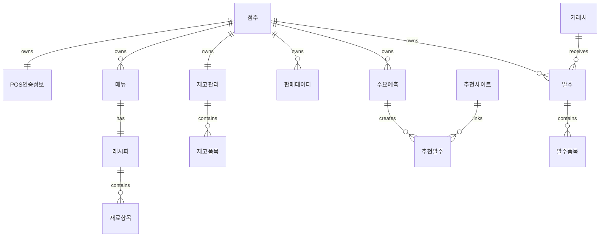

# ERD 설계서

## 1. 도메인 및 엔티티

기술 문서 기준 시스템은 6개 도메인, 14개 클래스로 구성된다.

| 도메인 | 엔티티 |
|---|---|
| 점주 | 점주, POS인증정보 |
| 메뉴 | 메뉴, 레시피, 재료항목 |
| 재고 | 재고관리, 재고품목 |
| 판매데이터 | 판매데이터 |
| 수요예측 | 수요예측 |
| 발주 | 발주, 발주품목, 거래처, 추천사이트, 추천발주 |

## 2. 엔티티별 속성

### 2.1 점주

- 점주ID
- 이름
- 업종
- 연락번호

### 2.2 POS인증정보

- POS인증번호
- POS인증키명
- 상태
- 연동일자

### 2.3 메뉴

- 메뉴ID
- 메뉴명
- 가격
- 분류

### 2.4 레시피

- 레시피ID
- 필요수량

### 2.5 재료항목

- 재료ID
- 재료명
- 규격
- 단위

### 2.6 재고관리

- 재고ID
- 최종수정일

### 2.7 재고품목

- 식자재명
- 현재수량
- 안전재고수량
- 단위

### 2.8 판매데이터

- 판매데이터ID
- 판매날짜
- 가격

### 2.9 수요예측

- 예측ID
- 예측기간시작
- 예측기간마감
- 예측수량
- 생성일시

### 2.10 발주

- 발주번호
- 발주일자
- 발주상태
- 총수량

### 2.11 발주품목

- 발주수량
- 단가

### 2.12 거래처

- 거래처ID
- 거래처명
- 연락처
- 주소

### 2.13 추천사이트

- 사이트명
- API주소

### 2.14 추천발주

- 추천발주번호
- 추천수량
- 생성일시

## 3. 관계



## 4. 관계 구조

```text
점주 (1) -- (1) POS인증정보
점주 (1) -- (N) 메뉴
점주 (1) -- (1) 재고관리
점주 (1) -- (N) 판매데이터
점주 (1) -- (N) 수요예측
점주 (1) -- (N) 발주
메뉴 (1) -- (1) 레시피
레시피 (1) -- (N) 재료항목
재고관리 (1) -- (N) 재고품목
수요예측 (1) -- (N) 추천발주
발주 (1) -- (N) 발주품목
발주 (N) -- (1) 거래처
추천발주 (N) -- (1) 추천사이트
```

## 5. 데이터 흐름

```text
POS
→ 판매데이터 저장
→ AI 입력(외부 변수 결합)
→ 수요예측 생성(배치)
→ 추천발주 생성(사전)
→ 점주 확인/수정/승인
→ 발주 확정
→ Playwright를 통해 쿠팡 장바구니 자동 담기
→ 실제 결제는 쿠팡에서 진행
→ 폐기 데이터 + 점주 수정 이력
→ 모델 재학습 트리거
```

## 추가 작업 필요 항목

- 실제 DB 테이블명 확정 필요
- 컬럼 타입, 길이, NULL 허용 여부 정의 필요
- PK/FK 컬럼 상세 정의 필요
- 인덱스 설계 필요
- OrderApprovalLog 테이블 상세 정의 필요
- 암호화 대상 컬럼 정의 필요
- 파티셔닝 및 복제 적용 기준 정의 필요

