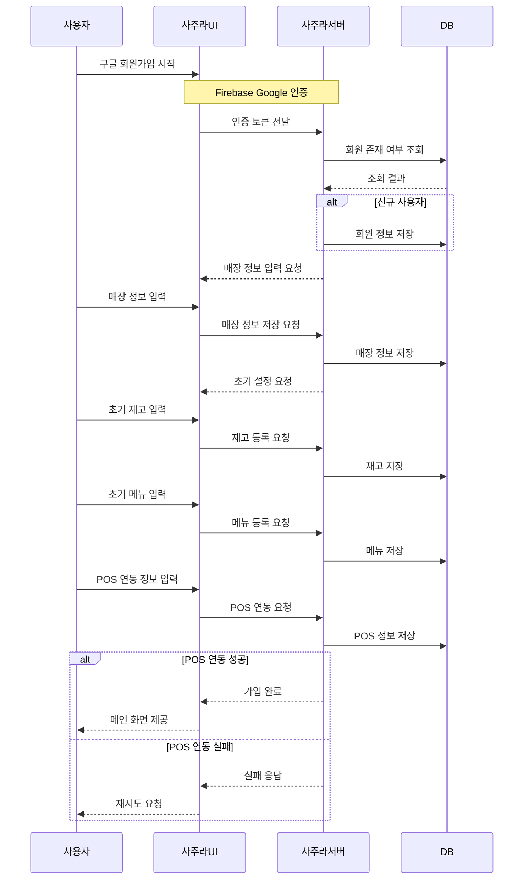
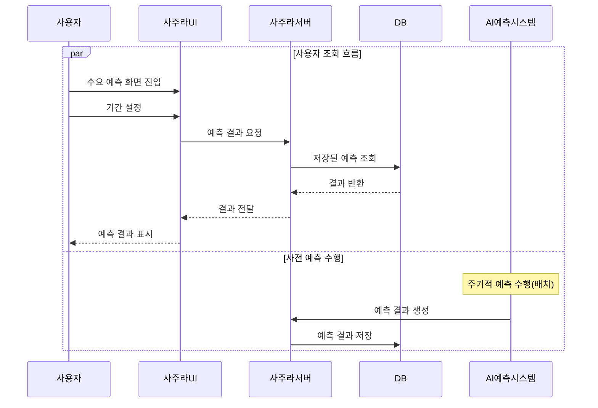
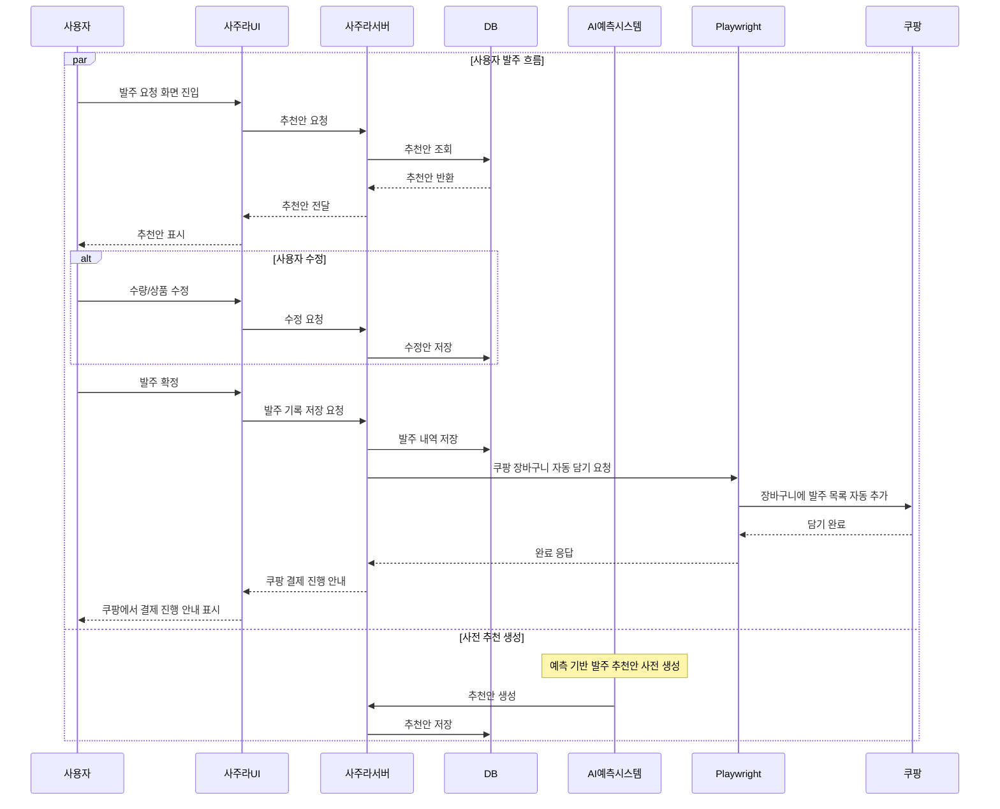

# 시퀀스 설계서

## 1. 전체 시스템 흐름

```text
1. 사용자 요청
2. Frontend → Backend
3. Backend → DB 조회(AI예측시스템이 사전 생성한 결과 조회)
4. 결과 존재 → 바로 반환
5. 결과 없음 → AI Server 직접 호출 → 결과 생성 → DB 저장 → 반환
6. 자동발주 트리거 시 추천발주 조회
7. 점주 승인 화면 제공
8. 점주 확인/수정/승인
9. 발주 기록 저장
10. Playwright를 통해 쿠팡 장바구니에 자동으로 담기
11. 실제 결제는 쿠팡에서 진행
12. 판매 결과, 폐기 데이터, 점주 수정 이력 수집
13. n8n 스케줄링으로 AI 모델 재학습 트리거
```

## 2. 회원가입 시퀀스



## 3. 수요예측 시퀀스



## 4. 발주요청 시퀀스



## 추가 작업 필요 항목

- API endpoint 기준 시퀀스 재정의 필요
- 오류 응답 코드별 대안 흐름 정의 필요
- 쿠팡 자동화 실패 시 재시도 흐름 정의 필요
- 알림 발송 상세 시퀀스 정의 필요

