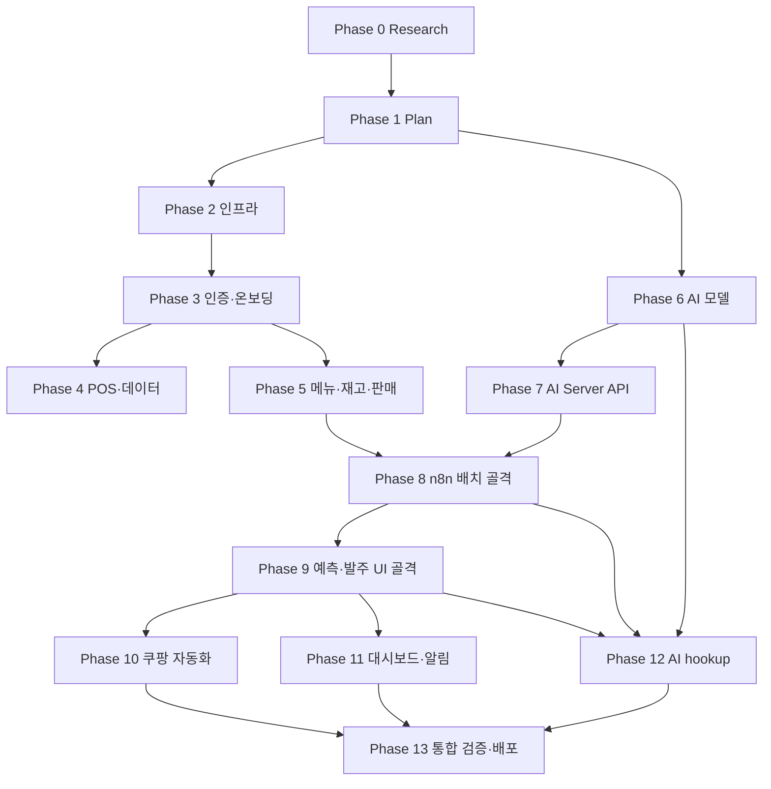

# 사주라 구현 간트차트

> 구현 작업 흐름과 파트 간 의존관계를 정의한다. 절대 일정(종료일)은 정하지 않으며, 단계 순서와 선행 작업 중심으로 표현한다.
>
> - 단위: **상대 일수(Day)**, 의존관계는 각 작업의 `deps` 필드로 표현
> - 참조: `PROGRESS.md`(전체 단계), `docs/spec/02_mvp/mvp_scope.md`(역할 분담), `docs/spec/07_backend/service_design.md`(서비스 클래스), `docs/spec/03_feature_design/feature_spec.md`(기능)
> - 본 차트는 **Research → Plan → 구현 → 통합·배포** 흐름을 다룬다. spec 작성·08_ai 미확정 항목 조사는 본 차트 범위 밖

---

## 1. 파트 및 담당자

> 기준: `docs/spec/02_mvp/mvp_scope.md` 섹션 9

| 파트 | 담당 업무 | 팀원 |
|------|----------|------|
| Frontend (FE) | 화면 설계, React/PWA, 수요예측·재고·발주 UI | 정동욱, 이민욱, 임형택 |
| AI Modeling (AI) | 데이터 수집·전처리, 모델 학습·평가, XAI, n8n 연동 | 정동욱, 이민욱, 서창현 |
| Backend (BE) | REST API, DB, n8n 배치 파이프라인, 쿠팡 자동화 | 서창현, 임형택 |

**공유 책임**
- n8n 파이프라인 설계: BE 주도, AI 연동 협의
- 데모 시나리오 검증: 전 파트 참여 (Step 1~9 end-to-end)

---

## 2. 단계 개요 (14 Phase)

| Phase | 이름 | 정의 | 주도 파트 |
|-------|------|------|----------|
| 0 | **Research** | 구현에 사용할 기술·오픈소스·라이브러리 조사 | BE / FE / AI 트랙별 |
| 1 | **Plan** | 실질적 구현 계획 수립 (스프린트·역할 분담·마일스톤) | 전 파트 |
| 2 | 인프라 부트스트랩 | Docker(MySQL·Redis·n8n), 3트랙 베이스(FastAPI/React PWA/AI Server), DB 마이그레이션 | BE+FE+AI |
| 3 | 인증·온보딩 | AuthService·StoreService·국세청 검증 + 사업자등록증 업로드·관리자 최소 심사(승인/반려), 로그인/온보딩/검증 화면, 통합 검증 | BE+FE |
| 4 | POS·데이터 적재 | POS 어댑터, CSV 업로드, 이상치 탐지, 화면 | BE+FE |
| 5 | 메뉴·재고·판매 도메인 | MenuService, InventoryService(FIFO·폐기·단가), SaleService 조회, 화면 | BE+FE |
| 6 | AI 모델 개발 | 데이터 전처리, 모델 비교/선정/평가, XAI 모듈 | AI |
| 7 | AI Server API | `/ai/forecast/*`, `/ai/orders/recommend`, `/ai/xai/*`, `/ai/health` + Backend AIServerClient | AI+BE |
| 8 | n8n 배치 (골격) | 외부 데이터 수집 + **전처리 더미 노드** + 야간 예측·주간 재학습 배치 + Slack 알림 | BE 주도 + AI 연동 |
| 9 | 예측·발주 UI (골격) | ForecastService 수량·OrderService + 수요예측·추천발주·홈 배지 화면 골격(근거·임계값 placeholder) | BE+FE |
| 10 | 쿠팡 자동화 | Playwright 자동화 + 결과 화면 | BE+FE |
| 11 | 대시보드·알림 | DashboardService(매출/예측), 인앱 알림, 대시보드 화면, **관리자 종합 관리도구 확장**(사용자·매장 관리 — Phase 3 최소 심사에서 확장) | BE+FE |
| 12 | **AI hookup** | AI 팀 확정 결과 반영 — n8n 전처리 실제 로직·예측 근거 응답/UI·신뢰도 임계값 | BE+FE |
| 13 | 통합 검증·배포 | 데모 시나리오 end-to-end, 성능·보안 검증, CI/CD 배포 | 전 파트 |

> **Research vs Plan 구분**
> - Research: "어떤 기술을 쓸지" 결정 — 라이브러리·프레임워크·오픈소스 비교, POC, 학습 곡선 평가
> - Plan: "어떻게 만들지" 결정 — 작업 분할, 스프린트 분배, 역할 매핑, 일정 추정

---

## 3. 작업 흐름 (큰 줄기)

**핵심 포인트**
- **AI 트랙(Phase 6~7)** 은 Plan 직후 BE/FE와 **병렬 출발**한다. 팀 보유 POS 데이터로 자체 학습 가능 (`mvp_scope.md` 섹션 8)
- BE/FE/AI 세 트랙의 **1차 합류는 Phase 8 골격**(인터페이스만 있으면 진행), **2차 합류는 Phase 12 hookup**(AI 결정 4가지 확정 후)
- Phase 12 AI hookup이 다루는 4가지: 예측 근거 응답/UI·신뢰도 임계값·n8n 전처리 실제 로직·예측 정확도 지표 (`HANDOFF.md` "AI 의존성")
- Phase 13은 모든 트랙 종착 후 진행 (`test_release` 의존에 hookup 끝점 포함)

---

## 4. 작업 목록 (총 25개)

| ID | 작업 | Phase | 기간 | 선행(deps) | 담당 |
|----|------|:-:|:-:|------|:-:|
| `res_be` | Backend 기술 스택 조사 (FastAPI·SQLAlchemy·Authlib·Playwright 후보 비교) | 0 | 4 | — | BE |
| `res_ai` | AI 모델·라이브러리 조사 (모델 후보·SHAP/XAI 도구·n8n 활용법) | 0 | 4 | — | AI |
| `res_fe` | Frontend 기술 스택 조사 (React PWA·UI 라이브러리·상태관리) | 0 | 3 | — | FE |
| `plan` | 구현 계획 수립 (스프린트·역할 분담·마일스톤·일정 추정) | 1 | 3 | res_be, res_ai, res_fe | ALL |
| `inf` | 인프라 부트스트랩 (Docker·DB 마이그레이션·3트랙 베이스) | 2 | 5 | plan | ALL |
| `auth_be` | AuthService(Authlib OAuth+JWT) + StoreService + 국세청 검증 | 3 | 7 | inf | BE |
| `auth_fe` | 로그인 + 온보딩 4스텝 화면 | 3 | 6 | inf | FE |
| `auth_test` | 인증·온보딩 통합 검증 | 3 | 2 | auth_be, auth_fe | ALL |
| `pos_be` | POS 어댑터 + CSV 업로드 + 이상치 탐지 모듈 | 4 | 5 | auth_test | BE |
| `pos_fe` | POS 연동·CSV 업로드 화면 | 4 | 4 | auth_test | FE |
| `dom_be` | MenuService(레시피·소프트삭제) + InventoryService(로트·FIFO·폐기·단가) + SaleService 조회 | 5 | 8 | auth_test | BE |
| `dom_fe` | 메뉴·재고·판매 데이터 화면 | 5 | 6 | dom_be | FE |
| `ai_data` | 데이터 전처리 모듈 (결측·이상치·표준화·단위통일) | 6 | 4 | plan | AI |
| `ai_model` | 모델 후보 비교·선정·평가 + XAI 모듈 + 신뢰도 경고 | 6 | 14 | ai_data | AI |
| `ai_api` | AI Server API + Backend AIServerClient | 7 | 5 | ai_model | AI |
| `n8n_data_skeleton` | 외부 API 수집 노드 + **전처리 더미 노드(통과·기본 채움)** | 8 | 3 | ai_api, dom_be | BE |
| `n8n_run` | 야간 예측 배치(02:00) + 주간 재학습 배치(일요일) + Slack 알림·재시도 | 8 | 5 | n8n_data_skeleton | BE |
| `ord_be_skeleton` | ForecastService(예측 수량 응답·근거 필드 placeholder·임계값 env 자리) + OrderService(추천 조회·수정·승인) | 9 | 4 | n8n_run | BE |
| `ord_fe_skeleton` | 수요예측 화면(수량 표시·근거 영역 placeholder) + 추천발주 화면 + 홈 배지 골격 | 9 | 4 | ord_be_skeleton | FE |
| `auto` | AutomationService(Playwright) + 자동화 결과 화면 | 10 | 7 | ord_be_skeleton | ALL |
| `dash` | DashboardService(매출/예측 집계) + 인앱 알림 + 대시보드 화면 | 11 | 7 | ord_be_skeleton | ALL |
| `n8n_data_hookup` | n8n 전처리 노드 실제 로직 반영 (결측 보간·이상치 탐지·AI 팀 확정 규칙) | 12 | 2 | n8n_data_skeleton, ai_model | BE |
| `ord_be_hookup` | ForecastService 예측 근거 응답 필드 형태 확정 반영 + 신뢰도 임계값 env 값 채움 | 12 | 2 | ord_be_skeleton, ai_model | BE |
| `ord_fe_hookup` | 예측 근거 UI 디자인·구현 + 신뢰도 낮음 배지 임계값 연결 | 12 | 3 | ord_fe_skeleton, ord_be_hookup | FE |
| `test_release` | 데모 시나리오 Step 1~9 + 성능·보안 검증 + CI/CD 배포 | 13 | 9 | auto, dash, ord_fe_hookup, n8n_data_hookup | ALL |

---

## 5. 검증 좌표 (Phase별 시작·종료 Day)

> 의존관계 기반으로 계산한 Phase별 좌표. 작업·의존이 바뀌면 본 표를 갱신한다.

| Phase | 이름 | 시작 Day | 종료 Day | 비고 |
|:-:|------|:-:|:-:|------|
| 0 | Research | 0 | 4 | 3트랙 병렬 |
| 1 | Plan | 4 | 7 | |
| 2 | 인프라 | 7 | 12 | |
| 3 | 인증·온보딩 | 12 | 21 | |
| 4 | POS·데이터 | 21 | 26 | |
| 5 | 메뉴·재고·판매 | 21 | 35 | |
| 6 | AI 모델 | 7 | 25 | **Plan 직후 병렬 출발** |
| 7 | AI Server API | 25 | 30 | |
| 8 | n8n 배치 (골격) | 30 | 38 | 더미 전처리 노드 |
| 9 | 예측·발주 UI (골격) | 38 | 46 | 근거·임계값 placeholder |
| 10 | 쿠팡 자동화 | 42 | 49 | ord_be_skeleton 후 시작 |
| 11 | 대시보드·알림 | 42 | 49 | ord_be_skeleton 후 시작 |
| 12 | AI hookup | 33 | 49 | n8n hookup은 Day 33부터·예측 hookup은 Day 42부터 (deps 차이) |
| 13 | 통합 검증·배포 | 49 | 58 | 차트 우측 끝 |

**전체 종료 좌표: Day 58** (분할·병렬화로 기존 Day 62 대비 4일 단축)

---

## 6. 마일스톤

각 Phase 안에 다수 마일스톤이 존재. **BE 마일스톤은 [`be/phase_XX_*.md`](be/), FE 마일스톤은 [`fe/phase_XX_*.md`](fe/), AI 마일스톤은 [`ai/phase_XX_*.md`](ai/)** 에서 정의·관리. 본 §6은 Phase별 파일 색인.

| Phase | 이름 | Day | BE 파일 | FE 파일 | AI 파일 |
|:-:|------|:-:|------|------|------|
| 0 | Research | 0~4 | [phase_00_research.md](be/phase_00_research.md) | [phase_00_research.md](fe/phase_00_research.md) | [phase_00_research.md](ai/phase_00_research.md) |
| 1 | Plan | 4~7 | 본 plan_gantt.md 자체 — 별도 파일 없음 | 본 plan_gantt.md 자체 — 별도 파일 없음 | 본 plan_gantt.md 자체 — 별도 파일 없음 |
| 2 | 인프라 | 7~12 | [phase_02_infra.md](be/phase_02_infra.md) | [phase_02_infra.md](fe/phase_02_infra.md) | [phase_02_infra.md](ai/phase_02_infra.md) |
| 3 | 인증·온보딩 | 12~21 | [phase_03_auth.md](be/phase_03_auth.md) | [phase_03_auth.md](fe/phase_03_auth.md) | — (AI 무관) |
| 4 | POS·데이터 | 21~26 | [phase_04_pos.md](be/phase_04_pos.md) | [phase_04_pos.md](fe/phase_04_pos.md) | — (AI 무관) |
| 5 | 도메인 | 21~35 | [phase_05_domain.md](be/phase_05_domain.md) | [phase_05_domain.md](fe/phase_05_domain.md) | — (AI 무관) |
| 6 | AI 모델 | 7~25 | — | — | [phase_06_model.md](ai/phase_06_model.md) |
| 7 | AI Server API | 25~30 | — (AIServerClient는 BE 작업, spec 합의 Phase 12 기준) | — | [phase_07_api.md](ai/phase_07_api.md) |
| 8 | n8n 배치 (골격) | 30~38 | [phase_08_n8n.md](be/phase_08_n8n.md) | — BE only | — (BE 주도, AI 데이터 협의) |
| 9 | 예측·발주 UI (골격) | 38~46 | [phase_09_order.md](be/phase_09_order.md) | [phase_09_order.md](fe/phase_09_order.md) | — |
| 10 | 쿠팡 자동화 | 42~49 | [phase_10_automation.md](be/phase_10_automation.md) | [phase_10_automation.md](fe/phase_10_automation.md) | — |
| 11 | 대시보드·알림 | 42~49 | [phase_11_dashboard.md](be/phase_11_dashboard.md) | [phase_11_dashboard.md](fe/phase_11_dashboard.md) | — |
| 12 | AI hookup | 33~49 | [phase_12_hookup.md](be/phase_12_hookup.md) | [phase_12_hookup.md](fe/phase_12_hookup.md) | [phase_12_hookup.md](ai/phase_12_hookup.md) |
| 13 | 통합 검증·배포 | 49~58 | [phase_13_release.md](be/phase_13_release.md) | [phase_13_release.md](fe/phase_13_release.md) | [phase_13_release.md](ai/phase_13_release.md) |

> **시계열 흐름** (Phase 번호 ≠ 도달 순서): Day 4 → 7 → 12 → 21 → 25(AI M6) → 26 → 30(AI M7) → 35 → 38 → 46 → 49(M10·M11·M12 동시 도달) → 58
>
> AI 트랙이 BE/FE 트랙 사이에 끼어 들어오는 게 정상 — Phase 6은 Plan 직후 병렬 출발.

**마일스톤 ID 규칙**

- BE 마일스톤: `M{Phase}.B{n}` (예: M3.B1 = Phase 3 BE 1번 마일스톤)
- FE 마일스톤: `M{Phase}.F{n}` (예: M3.F1 = Phase 3 FE 1번 마일스톤)
- AI 마일스톤: `M{Phase}.A{n}` (예: M6.A1 = Phase 6 AI 1번 마일스톤)
- 통합 마일스톤(BE·FE 양쪽 종착): `M{Phase}` (예: M3 = Phase 3 통합 종료)
