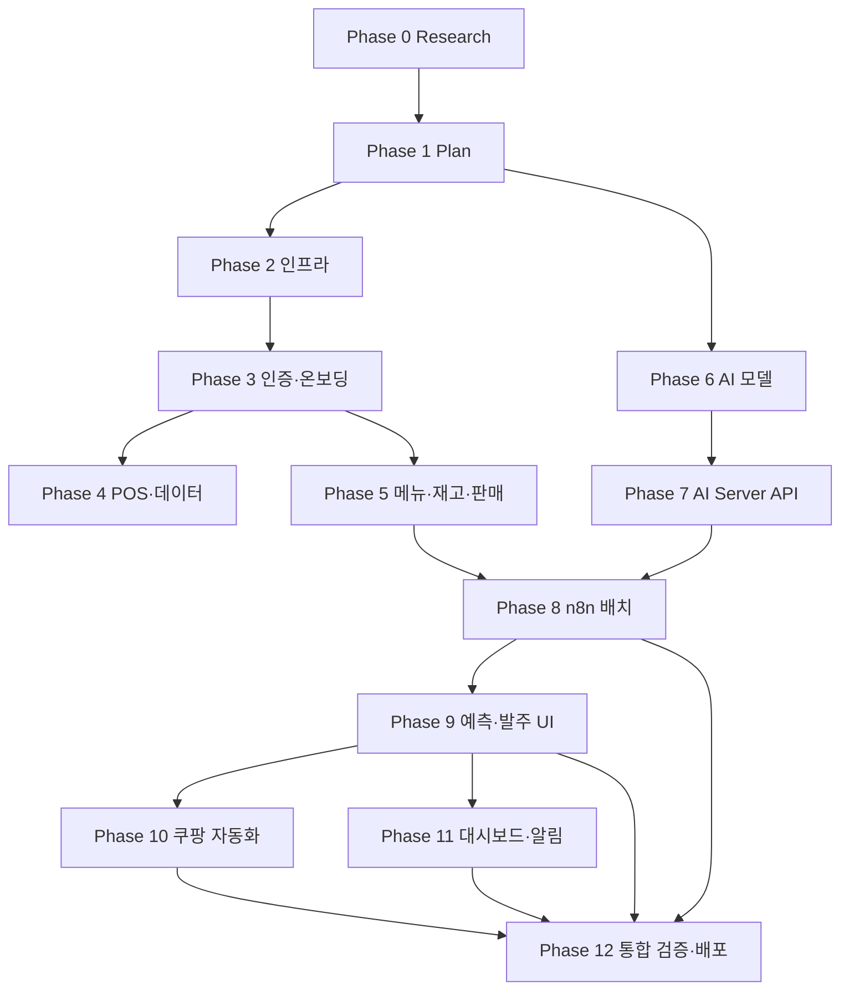

# 사주라 구현 간트차트

> 구현 작업 흐름과 파트 간 의존관계를 정의한다. 절대 일정(종료일)은 정하지 않으며, 단계 순서와 선행 작업 중심으로 표현한다.
>
> - 단위: **상대 일수(Day)**, 의존관계는 각 작업의 `deps` 필드로 표현
> - 참조: `PROGRESS.md`(전체 단계), `docs/spec/02_mvp/mvp_scope.md`(역할 분담), `docs/spec/07_backend/service_design.md`(서비스 클래스), `docs/spec/03_feature_design/feature_spec.md`(기능)
> - 본 차트는 **Research → Plan → 구현 → 통합·배포** 흐름을 다룬다. spec 작성·08_ai 미확정 항목 조사는 본 차트 범위 밖

---

## 1. 파트 및 담당자

> 기준: `docs/spec/02_mvp/mvp_scope.md` 섹션 9

| 파트 | 담당 업무 | 팀원 |
|------|----------|------|
| Frontend (FE) | 화면 설계, React/PWA, 수요예측·재고·발주 UI | 정동욱, 이민욱, 임형택 |
| AI Modeling (AI) | 데이터 수집·전처리, 모델 학습·평가, XAI, n8n 연동 | 정동욱, 이민욱, 서창현 |
| Backend (BE) | REST API, DB, n8n 배치 파이프라인, 쿠팡 자동화 | 서창현, 임형택 |

**공유 책임**
- n8n 파이프라인 설계: BE 주도, AI 연동 협의
- 데모 시나리오 검증: 전 파트 참여 (Step 1~6 end-to-end)

---

## 2. 단계 개요 (13 Phase)

| Phase | 이름 | 정의 | 주도 파트 |
|-------|------|------|----------|
| 0 | **Research** | 구현에 사용할 기술·오픈소스·라이브러리 조사 | BE / FE / AI 트랙별 |
| 1 | **Plan** | 실질적 구현 계획 수립 (스프린트·역할 분담·마일스톤) | 전 파트 |
| 2 | 인프라 부트스트랩 | Docker(MySQL·Redis·n8n), 3트랙 베이스(FastAPI/React PWA/AI Server), DB 마이그레이션 | BE+FE+AI |
| 3 | 인증·온보딩 | AuthService·StoreService·국세청 검증, 로그인/온보딩 화면, 통합 검증 | BE+FE |
| 4 | POS·데이터 적재 | POS 어댑터, CSV 업로드, 이상치 탐지, 화면 | BE+FE |
| 5 | 메뉴·재고·판매 도메인 | MenuService, InventoryService(FIFO·폐기·단가), SaleService 조회, 화면 | BE+FE |
| 6 | AI 모델 개발 | 데이터 전처리, 모델 비교/선정/평가, XAI 모듈 | AI |
| 7 | AI Server API | `/ai/forecast/*`, `/ai/orders/recommend`, `/ai/xai/*`, `/ai/health` + Backend AIServerClient | AI+BE |
| 8 | n8n 배치 파이프라인 | 외부 데이터 수집, 전처리/정규화 워크플로우, 야간 예측·주간 재학습 배치 + Slack 알림 | BE 주도 + AI 연동 |
| 9 | 예측·발주 UI | ForecastService, OrderService, 수요예측·추천발주·홈 배지 화면 | BE+FE |
| 10 | 쿠팡 자동화 | Playwright 자동화 + 결과 화면 | BE+FE |
| 11 | 대시보드·알림 | DashboardService(매출/예측), 인앱 알림, 대시보드 화면 | BE+FE |
| 12 | 통합 검증·배포 | 데모 시나리오 end-to-end, 성능·보안 검증, CI/CD 배포 | 전 파트 |

> **Research vs Plan 구분**
> - Research: "어떤 기술을 쓸지" 결정 — 라이브러리·프레임워크·오픈소스 비교, POC, 학습 곡선 평가
> - Plan: "어떻게 만들지" 결정 — 작업 분할, 스프린트 분배, 역할 매핑, 일정 추정

---

## 3. 작업 흐름 (큰 줄기)

**핵심 포인트**
- **AI 트랙(Phase 6~7)** 은 Plan 직후 BE/FE와 **병렬 출발**한다. 팀 보유 POS 데이터로 자체 학습 가능 (`mvp_scope.md` 섹션 8)
- BE/FE/AI 세 트랙의 **합류 지점은 Phase 8 n8n 배치 한 곳**
- Phase 12는 모든 트랙 종착 후 진행 (`test_release` 의존에 모든 트랙 끝점 포함)

---

## 4. 작업 목록 (총 22개)

| ID | 작업 | Phase | 기간 | 선행(deps) | 담당 |
|----|------|:-:|:-:|------|:-:|
| `res_be` | Backend 기술 스택 조사 (FastAPI·SQLAlchemy·Authlib·Playwright 후보 비교) | 0 | 4 | — | BE |
| `res_ai` | AI 모델·라이브러리 조사 (모델 후보·SHAP/XAI 도구·n8n 활용법) | 0 | 4 | — | AI |
| `res_fe` | Frontend 기술 스택 조사 (React PWA·UI 라이브러리·상태관리) | 0 | 3 | — | FE |
| `plan` | 구현 계획 수립 (스프린트·역할 분담·마일스톤·일정 추정) | 1 | 3 | res_be, res_ai, res_fe | ALL |
| `inf` | 인프라 부트스트랩 (Docker·DB 마이그레이션·3트랙 베이스) | 2 | 5 | plan | ALL |
| `auth_be` | AuthService(Authlib OAuth+JWT) + StoreService + 국세청 검증 | 3 | 7 | inf | BE |
| `auth_fe` | 로그인 + 온보딩 4스텝 화면 | 3 | 6 | inf | FE |
| `auth_test` | 인증·온보딩 통합 검증 | 3 | 2 | auth_be, auth_fe | ALL |
| `pos_be` | POS 어댑터 + CSV 업로드 + 이상치 탐지 모듈 | 4 | 5 | auth_test | BE |
| `pos_fe` | POS 연동·CSV 업로드 화면 | 4 | 4 | auth_test | FE |
| `dom_be` | MenuService(레시피·소프트삭제) + InventoryService(로트·FIFO·폐기·단가) + SaleService 조회 | 5 | 8 | auth_test | BE |
| `dom_fe` | 메뉴·재고·판매 데이터 화면 | 5 | 6 | dom_be | FE |
| `ai_data` | 데이터 전처리 모듈 (결측·이상치·표준화·단위통일) | 6 | 4 | plan | AI |
| `ai_model` | 모델 후보 비교·선정·평가 + XAI 모듈 + 신뢰도 경고 | 6 | 14 | ai_data | AI |
| `ai_api` | AI Server API + Backend AIServerClient | 7 | 5 | ai_model | AI |
| `n8n_data` | 외부 API 수집 노드 + 전처리/정규화 워크플로우 | 8 | 5 | ai_api, dom_be | BE |
| `n8n_run` | 야간 예측 배치(02:00) + 주간 재학습 배치(일요일) + Slack 알림·재시도 | 8 | 5 | n8n_data | BE |
| `ord_be` | ForecastService(캐시 조회) + OrderService(추천 조회·수정·승인) | 9 | 6 | n8n_run | BE |
| `ord_fe` | 수요예측 화면 + 추천발주 화면 + 홈 경고 배지/알림 목록 | 9 | 7 | ord_be | FE |
| `auto` | AutomationService(Playwright) + 자동화 결과 화면 | 10 | 7 | ord_be | ALL |
| `dash` | DashboardService(매출/예측 집계) + 인앱 알림 + 대시보드 화면 | 11 | 7 | ord_be | ALL |
| `test_release` | 데모 시나리오 Step 1~6 + 성능·보안 검증 + CI/CD 배포 | 12 | 9 | auto, dash, ord_fe, n8n_run | ALL |

---

## 5. 검증 좌표 (Phase별 시작·종료 Day)

> 의존관계 기반으로 계산한 Phase별 좌표. 작업·의존이 바뀌면 본 표를 갱신한다.

| Phase | 이름 | 시작 Day | 종료 Day | 비고 |
|:-:|------|:-:|:-:|------|
| 0 | Research | 0 | 4 | 3트랙 병렬 |
| 1 | Plan | 4 | 7 | |
| 2 | 인프라 | 7 | 12 | |
| 3 | 인증·온보딩 | 12 | 21 | |
| 4 | POS·데이터 | 21 | 26 | |
| 5 | 메뉴·재고·판매 | 21 | 35 | |
| 6 | AI 모델 | 7 | 25 | **Plan 직후 병렬 출발** |
| 7 | AI Server API | 25 | 30 | |
| 8 | n8n 배치 | 30 | 40 | |
| 9 | 예측·발주 UI | 40 | 53 | |
| 10 | 쿠팡 자동화 | 46 | 53 | |
| 11 | 대시보드·알림 | 46 | 53 | |
| 12 | 통합 검증·배포 | 53 | 62 | 차트 우측 끝 |

**전체 종료 좌표: Day 62**

---

## 6. 마일스톤

| 마일스톤 | 도달 조건 | 의의 |
|---------|----------|------|
| M1 — Plan 확정 | `plan` 완료 (Day 7) | 모든 트랙 본격 개발 시작 |
| M2 — 인프라·인증 완료 | `auth_test` 통과 (Day 21) | 데모 시나리오 Step 1 동작 |
| M3 — 데이터 적재 가능 | `dom_be` 완료 (Day 29) | 데모 Step 2 동작, n8n 통합 가능 |
| M4 — AI 모델 동작 | `ai_api` 완료 (Day 30) | AI Server 단독 동작 검증 |
| M5 — 배치 동작 | `n8n_run` 완료 (Day 40) | 데모 Step 3 동작 |
| M6 — 예측·발주·자동화 통합 | `auto` 완료 (Day 53) | 데모 Step 4~6 동작, end-to-end 골격 완성 |
| M7 — MVP 릴리스 | `test_release` 완료 (Day 62) | 데모 검증 + 성능·보안 합격 + 배포 |
