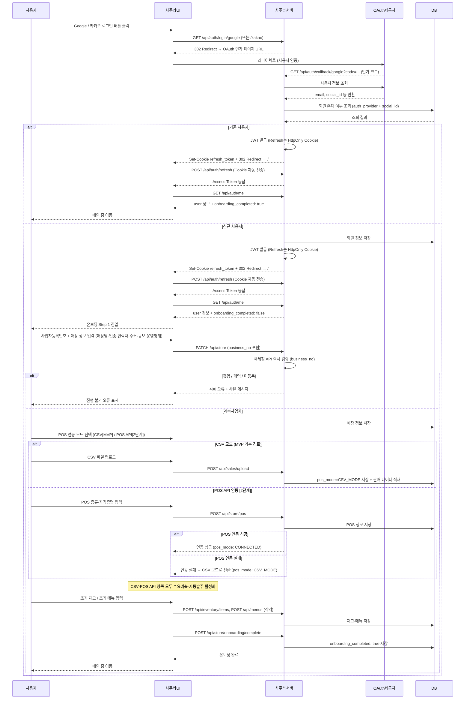
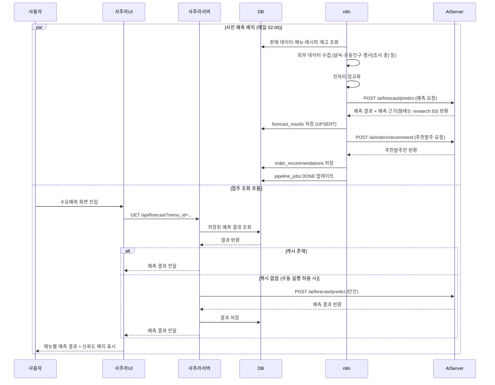
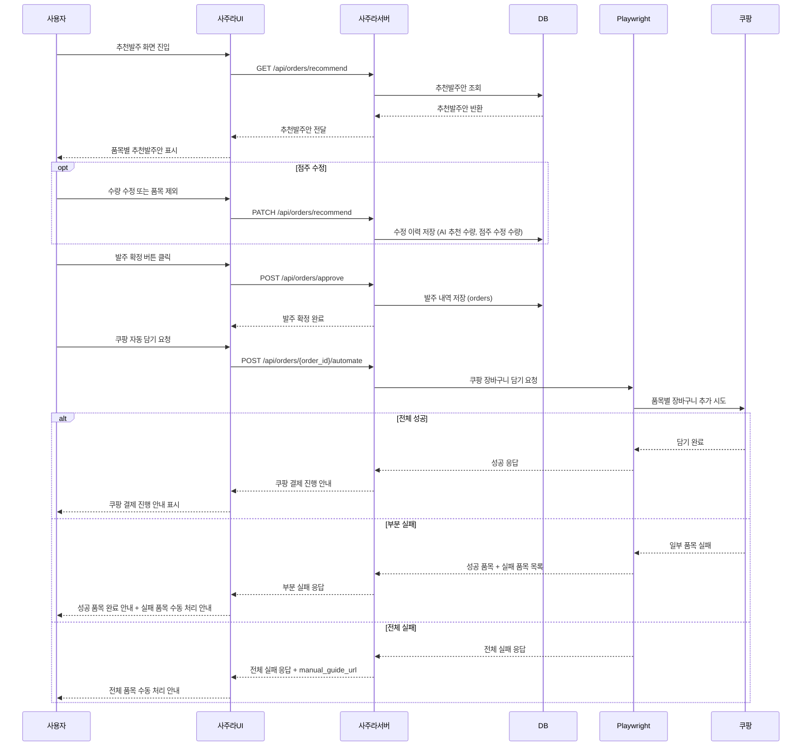
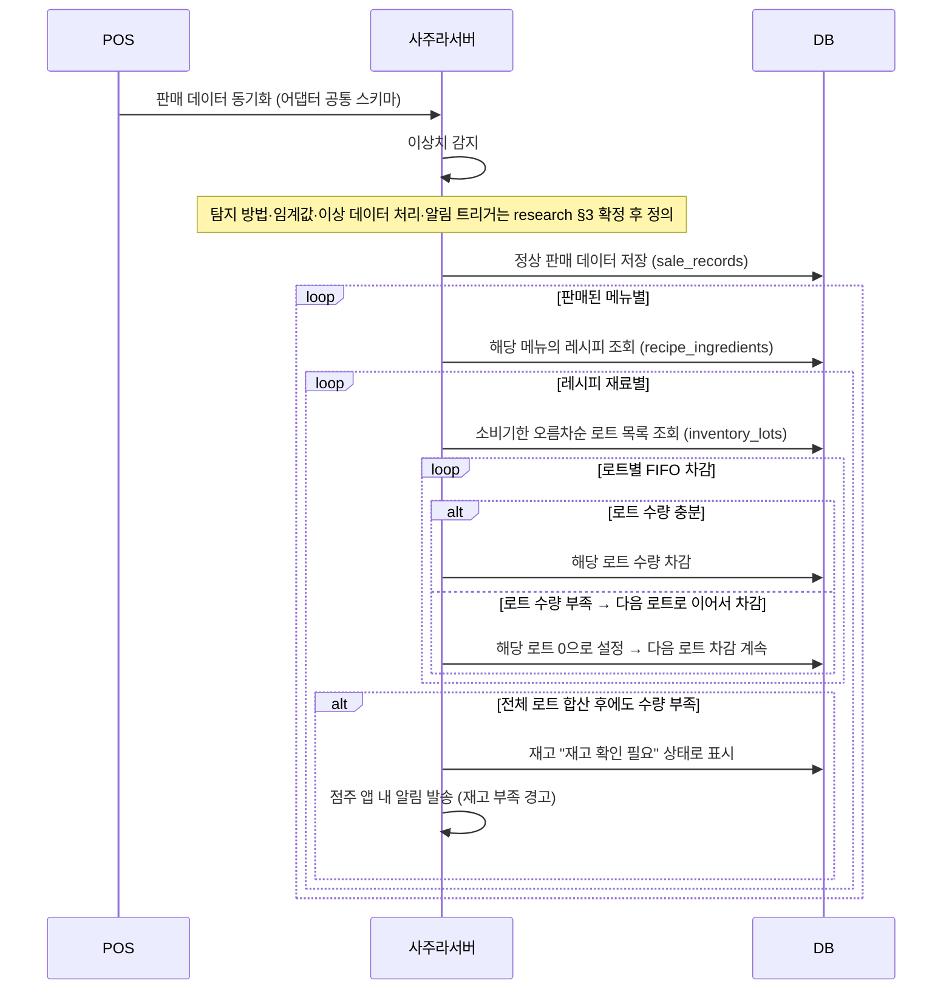
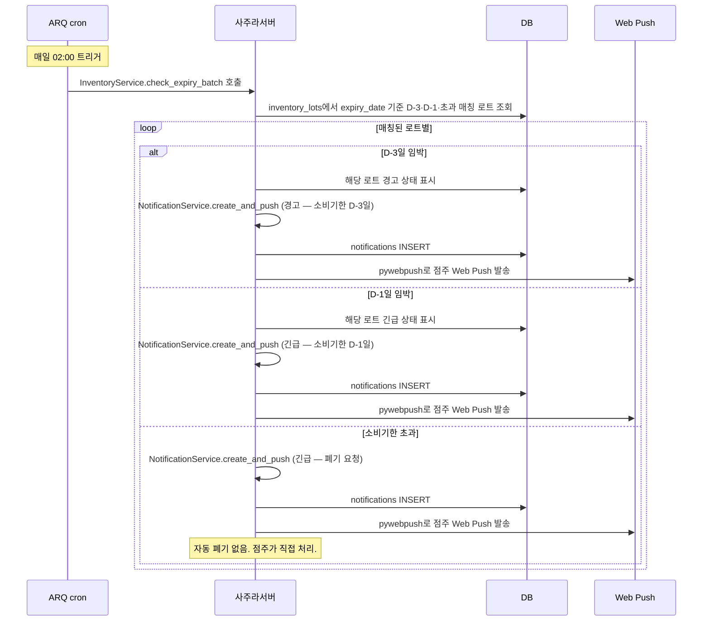
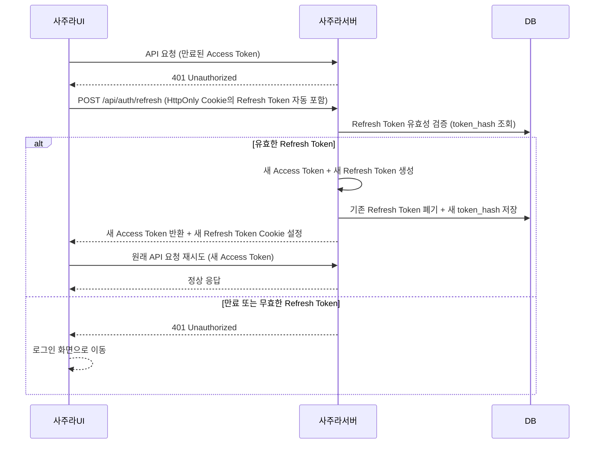

# 시퀀스 설계서

## 1. 전체 시스템 흐름

```text
[점주 요청 흐름]
1. 사용자 요청
2. Frontend → Backend API 호출
3. Backend → DB 조회 (n8n이 사전 생성·저장한 예측/추천 결과)
4. 결과 존재 → 즉시 반환
5. 결과 없음 → Backend가 AI Server 직접 호출 → 결과 생성 → DB 저장 → 반환

[발주 흐름]
6. 점주가 추천발주안 확인 / 수정 / 확정
7. 발주 내역 DB 저장
8. Playwright → 쿠팡 장바구니 자동 담기
9. 실제 결제는 쿠팡에서 진행

[배치 흐름 — n8n 주도]
10. 판매 결과, 폐기 데이터, 점주 수정 이력 DB 축적
11. n8n이 매일 02:00에 예측 배치 트리거 → AI Server 호출 → 결과 DB 저장
12. n8n이 매주 일요일 02:00에 재학습 배치 트리거 → AI Server 호출
```

---

## 2. 소셜 로그인 및 온보딩 시퀀스

> 인증 방식: Authlib OAuth 2.0, Firebase 미사용. API 기준: api_spec.md 섹션 2



---

## 3. 수요예측 시퀀스

> n8n이 예측 배치를 주도하고 결과를 DB에 사전 저장한다. Backend는 캐시된 결과만 반환한다.



---

## 4. 발주 확정 및 쿠팡 자동화 시퀀스

> 발주 확정과 쿠팡 자동화는 별도 엔드포인트로 분리된다. api_spec.md 기준.



---

## 5. 야간 배치 파이프라인 시퀀스

> 매일 02:00 실행. 각 단계 실패 시 3회 재시도 후 개발팀 Slack 알림. feature_spec.md 섹션 10.1 기준.

```mermaid
sequenceDiagram
    participant n8n
    participant DB
    participant ExternalAPI
    participant AIServer
    participant BE as 사주라서버
    participant Push as Web Push

    Note over n8n: 매일 02:00 트리거
    n8n->>DB: pipeline_jobs INSERT (type=FORECAST, status=RUNNING, triggered_by=N8N)
    n8n->>DB: 판매 데이터·메뉴·레시피·재고·리드타임·안전재고 조회
    n8n->>ExternalAPI: 날씨·유동인구·검색량[조사 중]·행사 정보[조사 중] 수집
    n8n->>n8n: 전처리·정규화 (결측값 처리, 이상치 필터링, 단위 통일, 외부 변수 병합)
    n8n->>AIServer: POST /ai/forecast/predict
    AIServer-->>n8n: 예측 결과 + 예측 근거(형태는 research §3) 반환
    n8n->>AIServer: POST /ai/orders/recommend
    AIServer-->>n8n: 추천발주안 반환
    n8n->>DB: forecast_results UPSERT (예측 결과; 근거 저장 컬럼은 research §3 확정 후 정의)
    n8n->>DB: order_recommendations INSERT (추천발주안)

    alt 전체 성공
        n8n->>DB: pipeline_jobs UPDATE (status=DONE)
        n8n->>BE: 알림 발송 API 호출 (예측 완료 + 추천발주안 생성, store_id 목록 전달)
        BE->>DB: NotificationService.create_and_push — notifications INSERT
        BE->>Push: pywebpush로 push_subscriptions 대상에 Web Push 전송
        BE-->>n8n: 발송 결과 반환
    else 단계 실패 (3회 재시도 후 지속)
        n8n->>DB: pipeline_jobs UPDATE (status=FAILED)
        n8n->>n8n: slack_sdk Webhook — 개발팀 채널에 직접 전송 (BE 경유 안 함, 도메인 무관)
    end
```

> 점주 알림은 BE `NotificationService.create_and_push`가 일관 처리(인앱 INSERT + Web Push). n8n은 BE API를 트리거할 뿐 직접 알림을 만들지 않는다. 개발팀 Slack 알림만 n8n에서 직접 발송.

---

## 6. 재고 자동 차감(FIFO) 시퀀스

> POS 판매 데이터 저장 시 레시피 기반으로 재고를 소비기한 오름차순(FIFO)으로 자동 차감한다.



---

## 7. 소비기한 배치 및 알림 시퀀스

> 매일 02:00 BE ARQ `cron_jobs`에서 실행. 자동 폐기 없음 — 점주 수동 처리 원칙.
> 소비기한 체크는 **재고 도메인 비즈니스 로직**이므로 BE가 책임 (n8n은 AI 파이프라인 도구라 책임 영역 아님).



---

## 8. Refresh Token 갱신 시퀀스

> Access Token 만료 시 Frontend가 자동으로 갱신 요청한다. Refresh Token은 사용마다 교체(Rotation).


