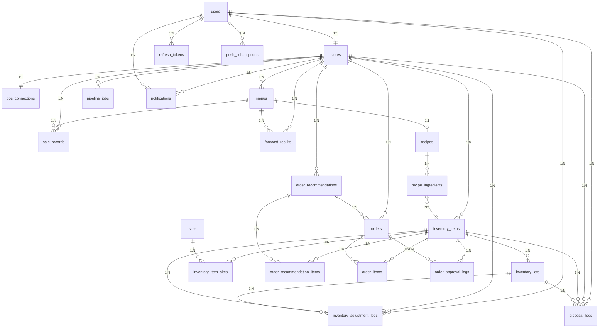

# ERD 설계서

## 1. 도메인 및 테이블 목록

| 도메인 | 테이블 |
|--------|--------|
| 인증 | `users`, `refresh_tokens` |
| 매장/POS | `stores`, `pos_connections` |
| 메뉴/레시피 | `menus`, `recipes`, `recipe_ingredients` |
| 재고 | `inventory_items`, `inventory_lots`, `inventory_adjustment_logs`, `disposal_logs`, `sites`, `inventory_item_sites` |
| 판매 | `sale_records` |
| 수요예측 | `forecast_results` |
| 발주 | `order_recommendations`, `order_recommendation_items`, `orders`, `order_items`, `order_approval_logs` |
| 파이프라인 | `pipeline_jobs` |
| 알림 | `notifications`, `push_subscriptions` |

총 23개 테이블

---

## 2. ERD 다이어그램



---

## 3. 관계 구조

```
users (1) ── (1) stores
users (1) ── (N) refresh_tokens
users (1) ── (N) inventory_adjustment_logs
users (1) ── (N) disposal_logs

stores (1) ── (1) pos_connections
stores (1) ── (N) menus
stores (1) ── (N) inventory_items
stores (1) ── (N) inventory_adjustment_logs
stores (1) ── (N) disposal_logs
stores (1) ── (N) sale_records
stores (1) ── (N) forecast_results
stores (1) ── (N) order_recommendations
stores (1) ── (N) orders
stores (1) ── (N) pipeline_jobs
stores (1) ── (N) notifications

users  (1) ── (N) notifications
users  (1) ── (N) push_subscriptions

menus  (1) ── (1) recipes
menus  (1) ── (N) sale_records
menus  (1) ── (N) forecast_results

recipes (1) ── (N) recipe_ingredients
recipe_ingredients (N) ── (1) inventory_items

inventory_items (1) ── (N) inventory_lots
inventory_items (1) ── (N) inventory_adjustment_logs
inventory_items (1) ── (N) disposal_logs
inventory_items (1) ── (N) inventory_item_sites

inventory_lots (1) ── (N) disposal_logs
inventory_lots (1) ── (N) inventory_adjustment_logs

sites (1) ── (N) inventory_item_sites

order_recommendations (1) ── (N) order_recommendation_items
order_recommendation_items (N) ── (1) inventory_items

orders (N) ── (1) order_recommendations   [NULL 허용 — 수동 발주 대비]
orders (1) ── (N) order_items
orders (1) ── (N) order_approval_logs

order_items (N) ── (1) inventory_items
order_approval_logs (N) ── (1) inventory_items
```

---

## 4. 데이터 흐름

```
POS 연동 / CSV 업로드
→ sale_records 적재

n8n 야간 배치 (매일 02:00)
→ pipeline_jobs 생성 (FORECAST, N8N)
→ DB에서 판매/메뉴/레시피/재고/설정 데이터 조회
→ 외부 API 데이터 수집
→ AI Server 수요예측 호출
→ AI Server 추천발주 호출
→ forecast_results 저장
→ order_recommendations + order_recommendation_items 저장
→ pipeline_jobs 상태 갱신

점주 확인/수정
→ order_recommendation_items.adjusted_quantity 업데이트

점주 발주 확정
→ orders + order_items 생성
→ order_approval_logs 기록 (추천값 vs 최종값)

Playwright 쿠팡 자동화
→ orders.status 업데이트 (AUTOMATED 또는 MANUAL_REQUIRED)

판매 발생
→ inventory_lots.remaining_quantity FIFO 차감

폐기 처리
→ disposal_logs 기록
→ inventory_lots.remaining_quantity 차감

재고 수동 수정
→ inventory_lots.remaining_quantity / expiry_date 수정
→ inventory_adjustment_logs 기록

n8n 주간 재학습 (매주 일요일 02:00)
→ pipeline_jobs 생성 (TRAIN, N8N)
→ DB에서 학습 데이터 조회
→ AI Server 재학습 호출
→ pipeline_jobs 상태 갱신
```
