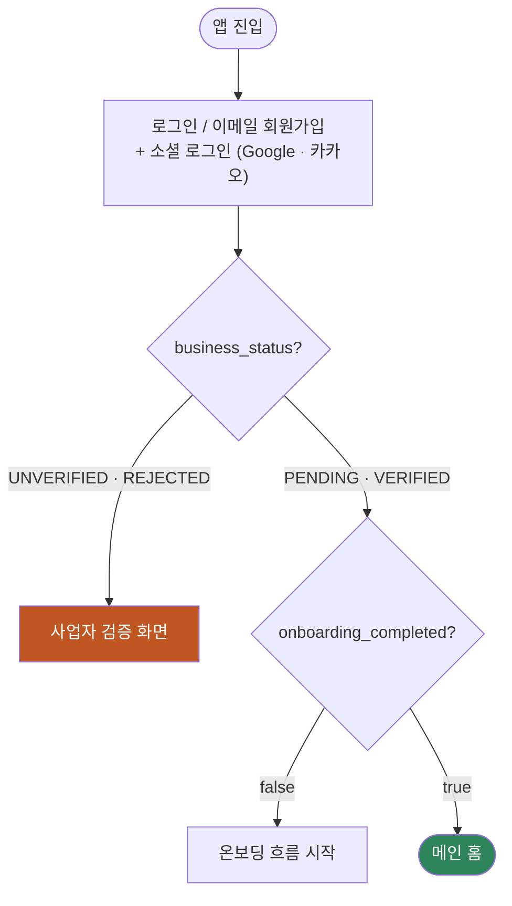
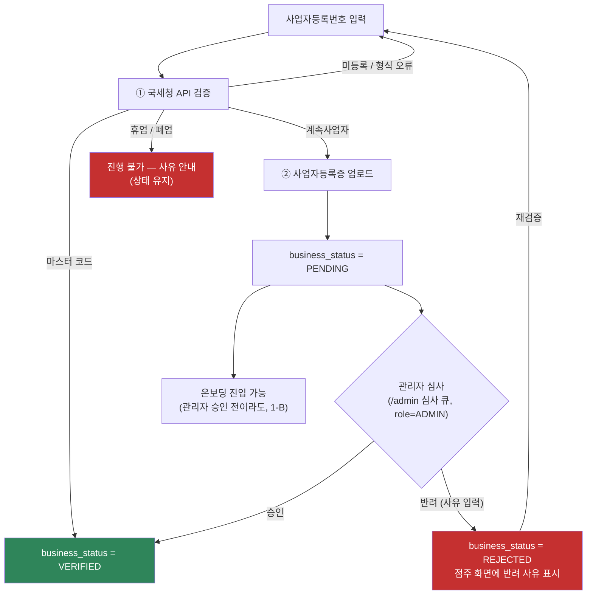
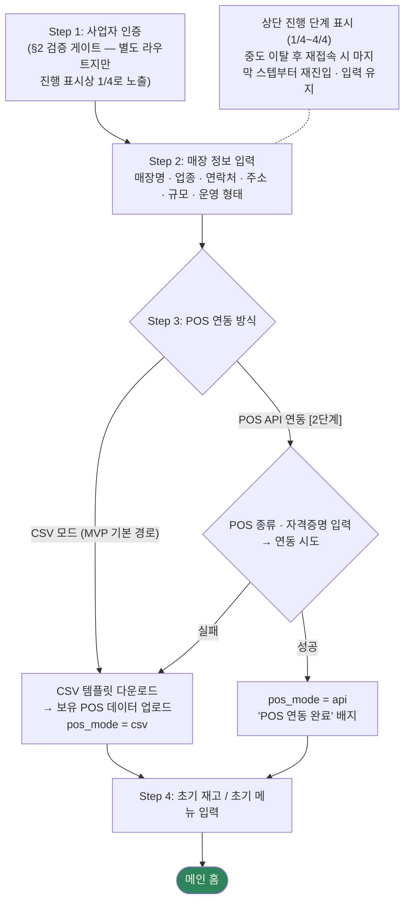
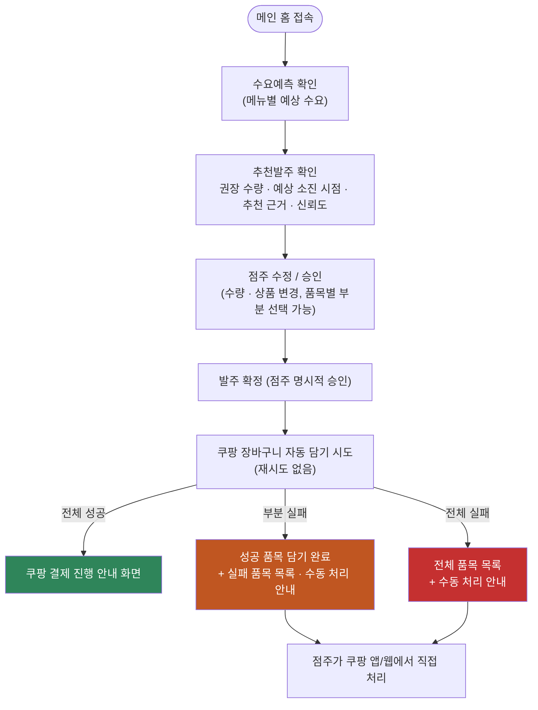
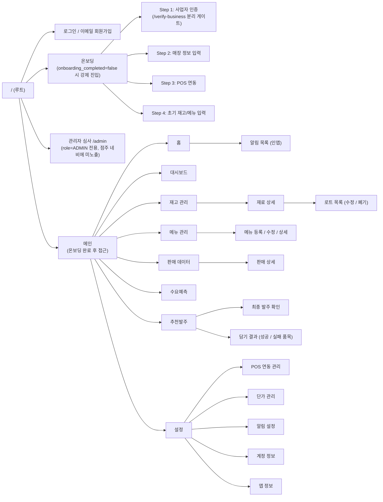
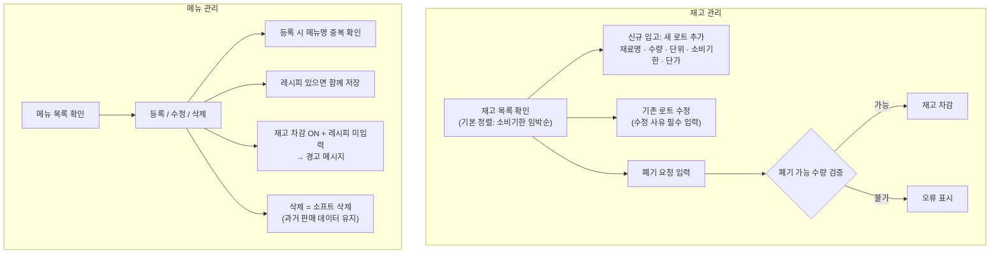
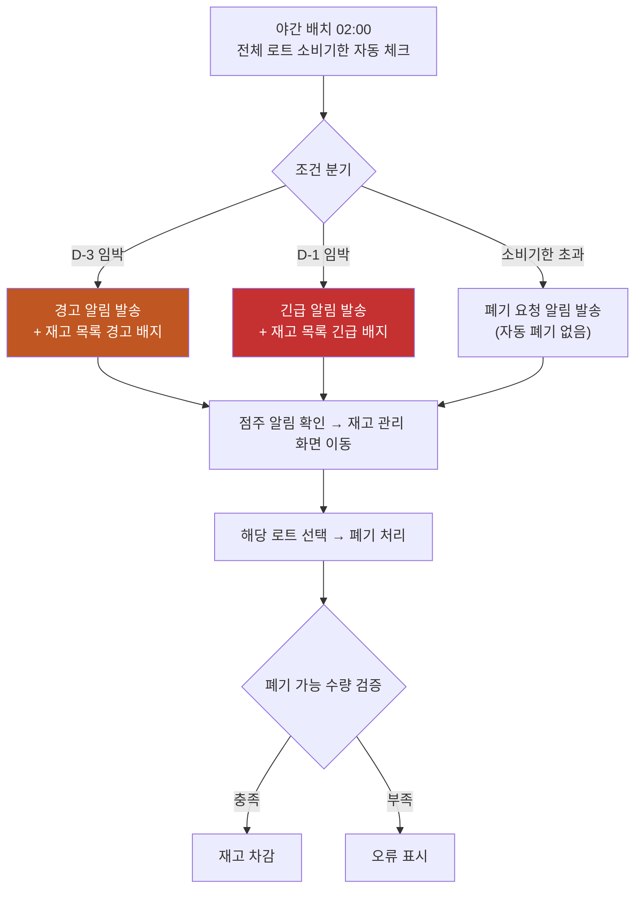

# 사주라 유저플로우 · 화면 구성 — 디자인 핸드오프

> **원본(SSOT)**: 흐름 = `docs/spec/04_flow/user_flow.md` · 화면별 구성 = `docs/spec/03_feature_design/feature_spec.md` §12 · 라우팅 = `docs/spec/07_frontend/frontend_design.md` §3
> 이 문서는 위 원본을 디자이너 전달용으로 합쳐 Mermaid로 시각화한 **파생본**입니다. 내용 수정은 원본에서 먼저 합니다.
> 문서 간 불일치 3건(로그인 구성·검증 게이트·관리자 화면)은 **PR #21 기준으로 해소된 내용**을 반영했습니다.

---

## 0. 디자인 전제 (먼저 읽어주세요)

| 항목 | 내용 |
|------|------|
| 대상 | 오프라인 식음료 매장 점주 (IT 역량 낮음 전제 — 쉬운 UI 우선) |
| 플랫폼 | **모바일 우선 PWA** (설치형 웹앱) |
| 글로벌 내비게이션 | **하단 탭 바 5개 고정**: 홈 / 재고 / 예측 / 발주 / 설정 |
| UI 킷 | Tailwind CSS v4 + **shadcn/ui** 컴포넌트 + lucide-react 아이콘 기반 구현 예정 |
| 배지 위계 | 긴급(D-1·초과) > 경고(D-3) > 정보 — 색 구분 필요 |
| 상태 화면 | 빈 상태 / 로딩 / 에러 화면은 spec에 정의 없음 → **디자이너 제안 영역** |
| 원칙 | AI는 추천만, 최종 확정은 항상 점주의 명시적 승인 (자동 결제 아님) |

---

## 1. 공통 진입 플로우 (로그인 → 게이트 분기)

---

## 2. 사업자 검증 게이트 (온보딩과 분리)

---

## 3. 온보딩 흐름 (Step 1~4)

> CSV / API 양쪽 모두 수요예측·자동발주 추천이 활성화되며, 설정 화면에서 모드 전환이 가능하다.

---

## 4. 일일 운영 흐름 (예측 → 발주 → 쿠팡 자동화)

---

## 5. 화면 IA (정보 구조)

**하단 네비게이션 바 (5개 탭 고정)**: 홈 / 재고 / 예측 / 발주 / 설정

---

## 6. 화면별 구성 요소 (와이어프레임 단위)

> 원본: `feature_spec.md` §12 (PR #21 반영 기준)

### 6.1 로그인 `/login` · 회원가입 `/register`

| 화면 | 구성 요소 |
|------|----------|
| 로그인 | 로고/서비스명(상단 중앙), 이메일·비밀번호 입력, 로그인 버튼, 회원가입 링크, Google·카카오 로그인 버튼, 서비스 소개 문구(하단) |
| 회원가입 | 이메일·비밀번호·이름 입력, 가입 버튼(완료 시 사업자 검증 화면 이동), 로그인 링크 |

### 6.2 사업자 검증 `/verify-business` (온보딩 Step 1로 노출)

사업자등록번호 입력 + 인증 요청 버튼 + 결과 메시지, 사업자등록증 업로드 영역(계속사업자 확인 후 노출), 심사 대기(PENDING) 안내, 반려 시 **반려 사유 표시** + 재검증 진입

### 6.3 온보딩 Step 2~4 `/onboarding/*`

| 스텝 | 구성 요소 |
|------|----------|
| Step 2. 매장 정보 | 매장명/업종/연락처/주소 입력, 매장 규모 구간 선택, 운영 형태 선택 |
| Step 3. POS 연동 | 모드 선택(CSV[MVP] / POS API[2단계]), CSV 템플릿 다운로드 + 업로드 영역, 연동 결과 메시지 |
| Step 4. 초기 재고/메뉴 | 재고 추가 폼(재료명/수량/단위/소비기한/단가), 메뉴 추가 폼(메뉴명/가격/재고 차감 여부/레시피), 완료 버튼 |

### 6.4 홈

경고 배지 영역(긴급→경고→정보 순 정렬), 오늘의 요약 카드(예측 판매량 상위 3개 메뉴 + 추천발주 대기 건수), 최근 인앱 알림 목록, 하단 네비게이션 바

### 6.5 대시보드 (단일 화면 스크롤, 탭 없음)

| 구성 요소 | 차트 |
|-----------|------|
| 조회 기간 선택기 (기본 주별) | - |
| 기간별 매출 추이 | 선 그래프 |
| 메뉴별 판매 비중 | 도넛 차트 |
| 수요예측 vs 실제 판매량 | 선 그래프 |
| 폐기율 추세 / 예측 정확도 추세 | 선 그래프 |
| 월별 폐기 비용 | 막대 그래프 |
| 전월 대비 폐기 비용 변화율 | 수치 + 증감 화살표 |

### 6.6 재고 관리 (기본 정렬: 소비기한 임박순)

재료 카드 목록(재료명·총 수량·단위·임박/긴급/초과 배지·재고 확인 필요 배지), 재고 추가 **플로팅 버튼(우하단)**, 재료 상세(로트 목록: 입고 일시·현재 수량·소비기한 / 신규 입고·로트별 수정/폐기 버튼 / 리드타임·안전재고 설정 필드), 추가/수정 폼(재료명·수량·단위·소비기한·단가·수정 사유 선택)

### 6.7 메뉴 관리 (정렬: 가나다순/판매량순, 역순 지원)

메뉴 카드 목록(메뉴명·가격·재고 차감 여부·레시피 미입력 경고 아이콘), 정렬 선택기, 메뉴 등록 **플로팅 버튼(우하단)**, 등록/수정 폼(메뉴명·가격·재고 차감 토글·레시피=재료 선택+사용량+단위 — 미등록 재료는 재고 등록으로 즉시 이동), 상세 화면(수정/삭제)

### 6.8 판매 데이터

기간 선택기(시작~종료, 최대 1년), 판매 목록(날짜·메뉴명·수량·매출액, 최신순), 기간 합계(총 건수·총 매출액), 판매 상세(시간대별 내역·메뉴별 수량·해당 일 총 매출)

### 6.9 수요예측 (1일/2일/3일 탭, 예측량 높은 순)

일자 탭, 메뉴별 예측 카드(메뉴명·예상 판매량·신뢰도 낮음 경고 배지), 예측 근거 펼치기, 신뢰도 경고 상세(배지 탭 시 사유: 정확도 부족/데이터 부족/결측 과다)

### 6.10 추천발주 (기본 정렬: 재료명 가나다순)

발주 기준일 표시, 품목별 발주 카드(**체크박스**·재료명·권장 수량·예상 소진 시점·추천 근거), 수량 인라인 수정 필드, 품목 제외 버튼, 전체/부분 승인 버튼, 최종 발주 확인 화면(수정 내용 요약), 담기 결과 화면(성공/실패 품목 + 수동 처리 안내)

### 6.11 설정

| 항목 | 구성 |
|------|------|
| POS 연동 관리 | 현재 모드 표시(CSV/API), CSV 업로드 버튼, API 재연동 버튼[2단계] |
| 단가 관리 | 재료별 단가 목록 + 최종 업데이트 일시, 수동 수정 |
| 알림 설정 | 유형별 on/off 토글 (소비기한 임박/재고 부족/예측 완료/이상치 감지) |
| 계정 정보 | 매장 정보 수정, 로그아웃, 회원 탈퇴(30일 뒤 영구 삭제 안내) |
| 앱 정보 | 버전, 이용약관, 개인정보처리방침 |

### 6.12 관리자 심사 `/admin` (ADMIN 전용, 점주 네비 미노출)

심사 큐 목록(PENDING 매장: 매장명·사업자번호·신청 일시, 오래된 순), 등록증 뷰어, 승인 버튼, 반려 버튼 + 사유 필수 입력

---

## 7. 재고 · 메뉴 관리 흐름

---

## 8. 소비기한 관리 흐름 (야간 배치)

---

## 9. 알림 수신 흐름

알림 채널: 점주 → 앱 내 알림(푸시 + 인앱). 홈 화면 경고 배지 영역에 **긴급 → 경고 → 정보** 우선순위 순으로 표시되고, 항목을 탭하면 해당 화면으로 이동한다.

| 알림 상황 | 탭 시 이동 화면 |
|----------|----------------|
| 재고 부족 ("재고 확인 필요") | 재고 관리 |
| 소비기한 D-3 / D-1 임박 | 재고 상세 |
| 소비기한 초과 폐기 요청 | 재고 상세 |
| 이상치 감지 | 판매 데이터 |
| 예측 완료 + 추천발주안 생성 | 추천발주 |

---

## 10. 라우트 매핑 (참고: `frontend_design.md` §3)

| 경로 | 화면 | 가드 |
|------|------|------|
| `/login` · `/register` | 로그인 / 이메일 회원가입 | 미인증만 |
| `/verify-business` | 사업자 검증 | 인증 + status ∈ {UNVERIFIED, REJECTED} |
| `/onboarding/*` | 온보딩 Step 2~4 | 인증 + status ∈ {PENDING, VERIFIED} + 온보딩 미완료 |
| `/` | 홈 | 인증 + 온보딩 완료 |
| `/dashboard` `/inventory` `/menus` `/sales` `/forecast` `/orders` | 각 기능 화면 | 인증 + 온보딩 완료 |
| `/admin` | 관리자 심사 큐 | role = ADMIN |

---

## 11. 열린 결정 (디자이너 확인/제안 환영)

- 온보딩 진행 표시: 현재 **4단계**(Step 1 = 검증 게이트를 1/4로 노출). 검증을 분리하고 3단계로 갈지 담당자 검토 중 (PR #21 참고)
- 빈 상태 / 로딩 / 에러 화면, 온보딩 이탈 방지 UX, 배지 색 체계는 spec 미정의 → 디자이너 제안 영역
