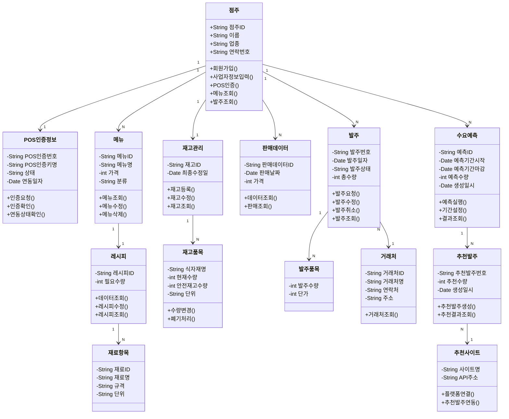
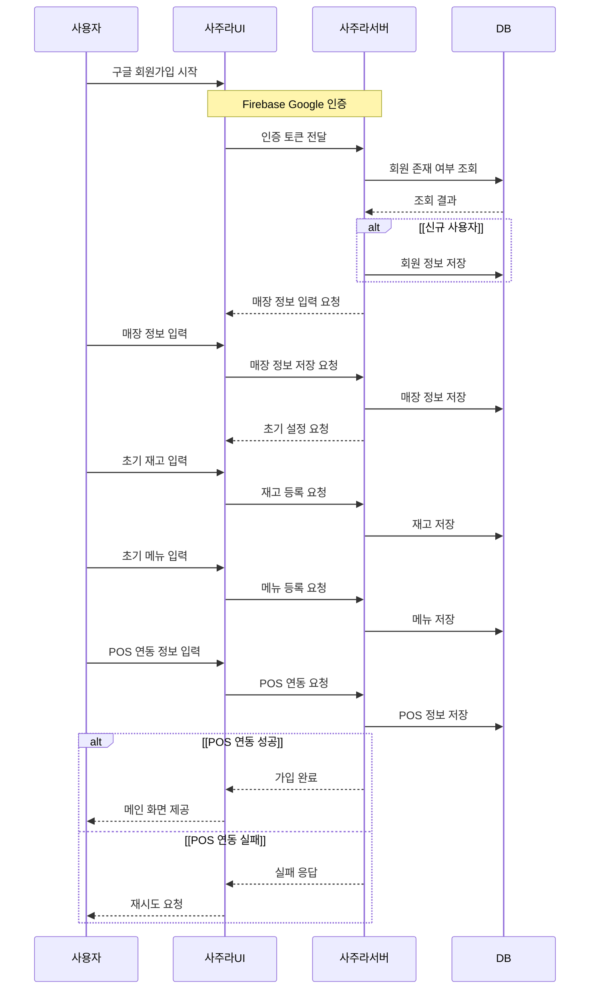
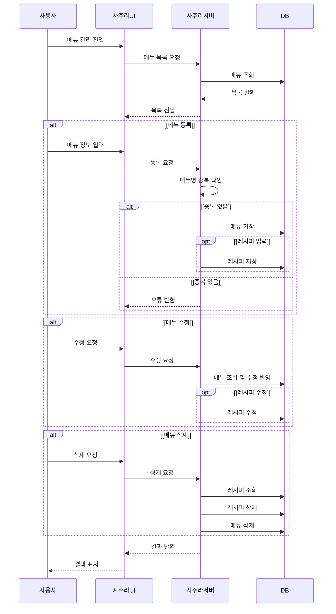
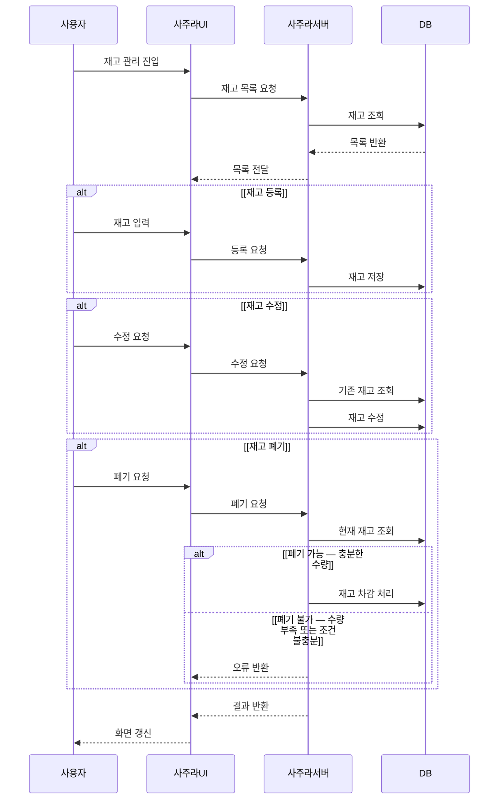
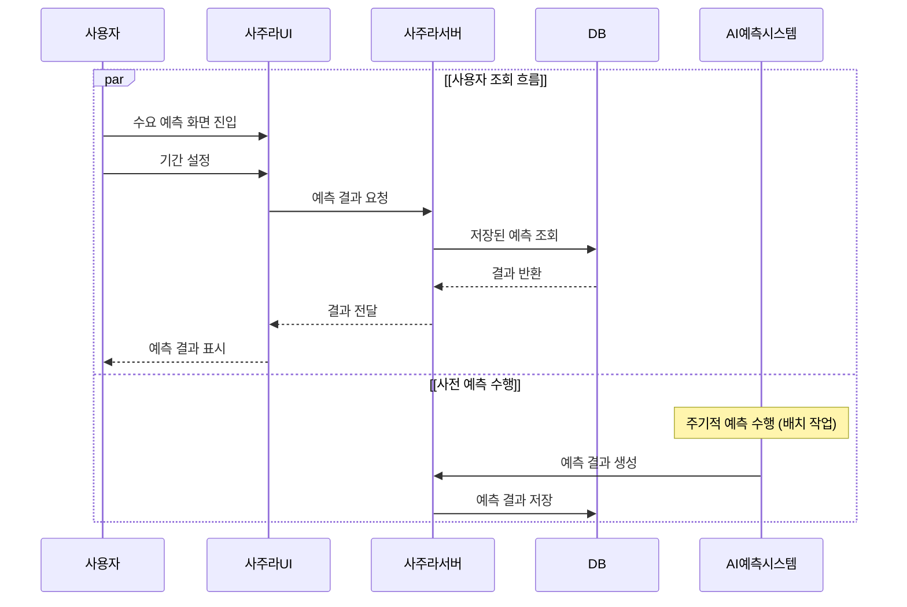
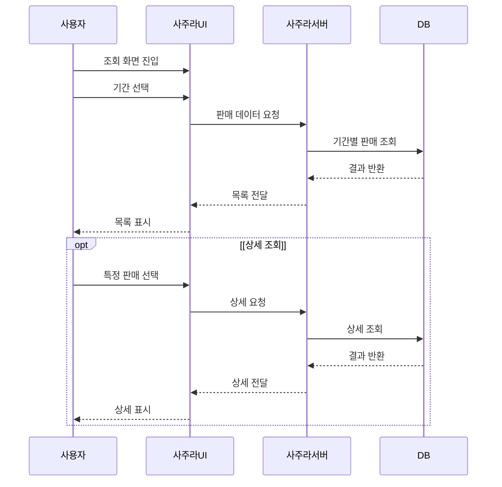
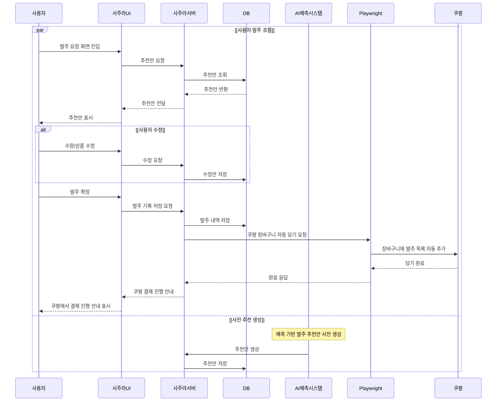
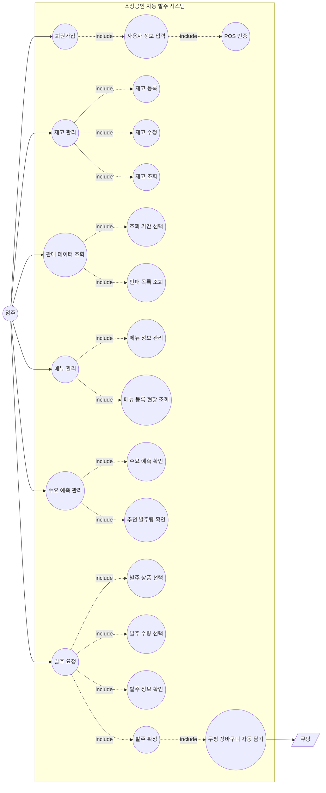

# 사주라(Sajura) 기술 설계 문서

> 본 문서는 기존 v9 기술 문서를 `docs/01`~`docs/09`에 작성된 최신 설계 기준으로 갱신한 기술 설계 문서입니다.
> `docs/08_ai`는 아직 AI 담당자가 인수인계 후 작성할 예정이므로 최신화 대상에서 제외합니다.
> 작성 규칙: 확실하지 않은 정보는 "확실하지 않음"으로 표시하고, 추측이 필요한 부분은 "추측입니다"라고 명시합니다.

---

## 0. 최신 설계 기준

본 문서의 1~14장은 아래 문서를 기준으로 최신화한다. 세부 명세는 원문 문서를 기준으로 하며, 이 문서는 핵심 내용과 위치를 함께 정리한다.

| 구분 | 문서 | 확인할 내용 |
|------|------|-------------|
| 01 요구사항 | `docs/01_requirements/requirements.md` | 프로젝트 개요, 문제 정의, 고객, 가치 제안, 기능/비기능 요구사항, 제약 조건 |
| 01 유즈케이스 | `docs/01_requirements/usecase_spec.md` | 액터, 회원가입, 재고 관리, 판매 데이터 조회, 메뉴 관리, 수요예측 관리, 발주 요청 유즈케이스 |
| 02 기능 목록 | `docs/03_feature_design/feature_list.md` | 핵심 기능 분류, 예측기반 발주, 추천발주, 점주 승인, 소비기한, POS 어댑터, AI/XAI, 자동화 파이프라인 |
| 02 기능 상세 | `docs/03_feature_design/feature_spec.md` | 인증, 온보딩, 메뉴/레시피, 재고, POS, 판매 조회, 수요예측, 추천발주, 쿠팡 자동화, 대시보드, 알림, 화면별 UI 구성 |
| 03 API | `docs/05_api/api_spec.md` | 공통 API 규약, 인증, 매장/POS, 메뉴/레시피, 재고, 판매, 수요예측/추천발주/발주, AI Server 연동 API, 대시보드/파이프라인/데이터 API |
| 04 DB 스키마 | `docs/06_database/schema.md` | MySQL 공통 규칙, 21개 테이블 스키마, 인덱스 설계, DB 계정 분리, 암호화 대상 컬럼 |
| 04 ERD | `docs/06_database/erd.md` | 도메인별 테이블 목록, Mermaid ERD, 관계 구조, 데이터 흐름 |
| 05 Backend | `docs/07_backend/service_design.md` | 기술 스택, 계층 구조, 서비스 클래스/메서드, 트랜잭션 경계, 서비스 호출 흐름, 권한 검사, 에러 코드, Redis 캐시 |
| 07 Flow | `docs/04_flow/user_flow.md` | 주요 사용자, 핵심 사용 흐름, 온보딩, 일일 운영, 재고/메뉴/판매/대시보드/소비기한/알림/설정 흐름, 화면 IA |
| 07 Sequence | `docs/04_flow/sequence.md` | 전체 시스템, 소셜 로그인/온보딩, 수요예측, 발주 확정/쿠팡 자동화, 야간 배치, FIFO 차감, 소비기한 알림, refresh token 시퀀스 |
| 08 Security | `docs/09_nonfunctional/security.md` | 보안 원칙, 인증/토큰, 개인정보, 암호화, 접근 통제, 감사 로그, 외부 API/약관, 사용자 권리 |
| 08 Performance | `docs/09_nonfunctional/performance.md` | API 응답 시간, 동시 사용자 기준, 배치 예측, 캐싱, 야간 배치 SLA, 서버 분리, DB 성능, 모니터링, Playwright 타임아웃 |
| 09 MVP | `docs/02_mvp/mvp_scope.md` | MVP 목표, 1차 검증 업종, 포함/제외 기능, 성공 기준, 데모 시나리오, 고도화 로드맵, 데이터 확보 방식, 역할 분담 |

### 0.1 최신화 제외 문서

| 구분 | 문서 | 처리 기준 |
|------|------|-----------|
| 06 AI | `docs/08_ai/ml_pipeline.md` | AI 담당자가 인수인계 후 작성 예정이므로 현재 기술문서 최신화 기준에서 제외 |
| 06 AI | `docs/08_ai/model_spec.md` | AI 담당자가 인수인계 후 작성 예정이므로 현재 기술문서 최신화 기준에서 제외 |

### 0.2 01~09 외 기존 자료 보존 기준

01~09 문서에 아직 반영되지 않은 발표 자료, 시장 통계, 관련 연구, 특허, TRIZ 분석은 삭제하지 않고 기존 섹션에 보존한다. 단, 최신 설계와 충돌할 수 있는 구현 상세는 01~09 문서를 우선한다.

---

## 1. 프로젝트 개요

### 1.1 프로젝트 목적

사주라(Sajura)는 **소상공인을 위한 AI 기반 자동발주 & 매출분석 솔루션**입니다.

목표는 재고/발주의 의사결정을 데이터 기반으로 자동화하고, 매출 분석을 통해 매장 운영 인사이트를 제공하는 것입니다.

자세한 기준은 `docs/01_requirements/requirements.md`의 1장, 4장을 따른다.

---

### 1.2 해결하려는 문제 (Problem)

매장 운영자들은 매일 반복되는 비효율적인 재고 관리와 발주 시스템으로 인해 핵심 업무에 집중하지 못하고 있다.
최신 요구사항 문서는 이를 다음 3가지 문제로 정의한다.

1. **수작업 재고 관리**
   - 소상공인 70%가 수기 또는 엑셀로 재고를 관리하며, 인적 오류와 시간낭비가 발생한다.
2. **감에 의존한 발주**
   - 과거 경험과 감각에 의존한 발주로 과잉재고 또는 결품이 빈번하게 발생한다.
3. **매출 분석의 부재**
   - 날씨, 요일, 시즌 등 외부 변수가 매출에 미치는 영향을 파악하지 못한다.
   - POS, 재고, 발주 데이터가 분리되어 빠른 판단이 어렵다.

자세한 기준은 `docs/01_requirements/requirements.md`의 2장을 따른다.

> → 소상공인의 재고·발주·매출 관리를 AI로 자동화하는 올인원 솔루션이 필요하다.
>

**01~09 외 기존 자료 기반 참고**
- 소상공인 사업체: **790.7만 개**
- 외식업체 영업이익률: **8.7%**
- 식재료비·인건비 부담 지속 증가
- *(출처: 중소벤처기업부(2023), 전산업(소상공인) 기준 통계 / 농림축산식품부·한국농촌경제연구원(2025 외식업체 경영실태조사))*

**NEEDS 관련 뉴스 사례**
- — 대부분의 사장님들이 재고관리에 1~2시간, 매출 정리에 30분 소요. 휴대폰으로 실시간 확인 가능하게 하면 퇴근 시간이 크게 단축된다는 실질적 시간 절약 효과 강조.
- 이벤트 수요 예측 실패로 발주 350개 중 판매 미달, 삼각김밥 품목별 200~300개씩 발주 후 절반 넘게 폐기.

---

### 1.3 핵심 고객 세그먼트 (Customer Segments)

사주라는 매일 재고와 발주 업무를 직접 처리하는 **오프라인 식음료 매장 운영자**를 핵심 고객으로 둔다. 개발 최우선 대상은 음식점 운영 소상공인이다.

| 세그먼트 | 설명 |
|----------|------|
| 음식점 및 카페 소상공인 | 식자재 회전율이 높고 일일 발주가 필요한 개인 매장 |
| 소규모 프랜차이즈 매장 | 본사 물류 외에 개별적인 식자재 관리가 병행되어야 하는 가맹점 |
| 직접 관리하는 자영업자 | 전담 관리 직원 없이 사장님이 직접 재고 관리와 발주를 도맡아 하는 모든 사업장 |

자세한 기준은 `docs/01_requirements/requirements.md`의 3장을 따른다.

---

### 1.4 가치 제안 (Unique Value Proposition)

> "처음 한 번만 재고를 입력하세요. 이후의 재고 관리와 발주 판단은 AI가 모두 대신합니다."

---

### 1.5 핵심 기능 (Solution)

최신 기능 범위는 다음 문서에 분리되어 있다.

| 기능 영역 | 최신 기준 위치 |
|-----------|----------------|
| 인증/회원가입/온보딩 | `docs/03_feature_design/feature_spec.md` 1장, `docs/05_api/api_spec.md` 2~3장 |
| POS 연동/CSV 업로드 | `docs/03_feature_design/feature_spec.md` 4장, `docs/05_api/api_spec.md` 3장, 6장 |
| 메뉴/레시피 관리 | `docs/03_feature_design/feature_spec.md` 2장, `docs/05_api/api_spec.md` 4장 |
| 재고/FIFO/폐기/소비기한 | `docs/03_feature_design/feature_spec.md` 3장, 11장, `docs/05_api/api_spec.md` 5장 |
| 판매 데이터 조회 | `docs/03_feature_design/feature_spec.md` 4-1장, `docs/05_api/api_spec.md` 6장 |
| 수요예측/신뢰도/XAI | `docs/03_feature_design/feature_spec.md` 5장, 9장, `docs/05_api/api_spec.md` 7~8장 |
| 추천발주/점주 승인 | `docs/03_feature_design/feature_spec.md` 6장, `docs/05_api/api_spec.md` 7장 |
| 쿠팡 장바구니 자동화 | `docs/03_feature_design/feature_spec.md` 7장, `docs/07_backend/service_design.md` 4장 |
| 대시보드/ROI | `docs/03_feature_design/feature_spec.md` 8장, `docs/05_api/api_spec.md` 9장 |
| 알림/화면 UI | `docs/03_feature_design/feature_spec.md` 11~12장, `docs/04_flow/user_flow.md` |

---

### 1.6 압도적인 경쟁우위 (Unfair Advantage)

최신 설계 기준에서의 차별점은 다음과 같다.

1. POS 판매 데이터와 레시피를 연결해 재고를 FIFO로 자동 차감한다.
2. 예측 결과를 DB에 사전 저장하고, 점주는 저장된 결과를 빠르게 조회한다.
3. AI는 추천만 수행하고, 발주 확정은 반드시 점주 승인 단계를 거친다.
4. 쿠팡 자동화는 발주 승인 이후 장바구니 담기까지만 보조하며, 결제는 쿠팡에서 진행한다.
5. MVP는 보유 중인 주점 POS 데이터를 활용해 단일 업종에서 먼저 검증한다.

기능 기준은 `docs/03_feature_design/feature_spec.md`, MVP 기준은 `docs/02_mvp/mvp_scope.md`를 따른다.

---

### 1.7 수익 및 비용 구조 (Business Model)

아래 내용은 01~09 최신 문서에 상세 확정되지 않은 기존 자료 기반 내용이므로 참고로 유지한다.

#### 1.7.1 수익 흐름 (Revenue Stream)

| 항목 | 설명 |
|------|------|
| SaaS 구독 모델 | 소상공인 대상 월간/연간 시스템 이용료 (Basic / Pro / Enterprise) |
| 발주 중개 수수료 | 앱 내에서 식자재 유통사로 발주가 일어날 시 발생하는 거래 중개 수수료 |
| 경영 분석 리포트 | 축적된 판매 및 원가 데이터를 기반으로 제공되는 프리미엄 상권/경영 분석 리포트 판매 |

#### 1.7.2 비용 구조 (Cost Structure)

| 항목 | 설명 |
|------|------|
| 연구 개발(R&D) 비용 | AI 예측 모델 고도화 및 데이터 분석 알고리즘 개발 인건비 |
| 인프라 운영 비용 | 클라우드 서버, 대용량 데이터베이스 유지 및 보안 관리 비용 |
| 연동 및 파트너십 비용 | 외부 POS 시스템, 식자재 쇼핑몰 API 연동 및 데이터 구매 비용 |
| 마케팅 및 영업 | 서비스 인지도 확보 및 가맹점 유치를 위한 운영 비용 |

---

## 2. 전체 시스템 아키텍처

### 2.1 구성 요소

| 구성 요소 | 기술 | 역할 |
|----------|------|------|
| Frontend | React, PWA | 사용자 UI (점주 승인 화면 포함) |
| Backend | FastAPI, SQLAlchemy async, aiomysql, Playwright, Redis | API, 비즈니스 로직, 권한 검사, 쿠팡 장바구니 자동화, 캐시 |
| AI Server | 작성 예정 | 수요예측, 추천발주, XAI 결과 생성. 06 문서 작성 전까지 상세 모델 설계 제외 |
| Database | MySQL | 데이터 저장 |
| Data Pipeline | n8n | 배치 오케스트레이션, DB/API 데이터 수집, AI Server 호출, 결과 저장, 재시도, Slack 알림 |
| Auth | Authlib, python-jose, passlib(bcrypt) | Google/카카오 OAuth, 이메일 로그인, JWT, 비밀번호 해싱 |
| External Automation | Playwright | 쿠팡 단가 조회 및 장바구니 자동 담기 |
| DevOps | GitHub Actions, Docker | CI/CD, Backend/AI 배포 환경 |
| 배포 | Firebase Hosting (Front), Docker (Back+AI) | 배포 인프라 |

Backend 기술 스택의 최신 기준은 `docs/07_backend/service_design.md` 1장을 따른다. AI Server 상세 설계는 `docs/08_ai` 작성 후 별도 반영한다.

---

### 2.2 구성 요소 역할

#### Frontend
- 로그인/온보딩, 홈, 대시보드, 메뉴 관리, 재고 관리, 판매 데이터, 수요예측, 추천발주, 설정 화면을 제공한다.
- 화면별 UI 구성은 `docs/03_feature_design/feature_spec.md` 12장, 사용자 흐름은 `docs/04_flow/user_flow.md`를 따른다.

#### Backend
- Controller / Service / Model(Repository) 3계층 구조를 적용한다.
- Controller는 HTTP 요청 수신, 파라미터 검증, JSON 응답 직렬화, 에러 핸들링을 담당한다.
- Service는 비즈니스 로직, 트랜잭션, 권한 검사, 캐시, 외부 서비스 호출 조율을 담당한다.
- Model(Repository)은 ORM 매핑, DB CRUD, 쿼리 실행을 담당한다.
- 서비스 클래스와 호출 흐름은 `docs/07_backend/service_design.md` 3~6장을 따른다.

#### Auth
- Google과 카카오 OAuth 2.0 흐름은 Backend에서 Authlib로 처리한다.
- 이메일/비밀번호 로그인도 지원하며, 비밀번호는 bcrypt로 해시한다.
- 자체 JWT Access Token과 Refresh Token을 발급한다.
- 인증 API는 `docs/05_api/api_spec.md` 2장, 보안 정책은 `docs/09_nonfunctional/security.md` 2장을 따른다.

#### AI Server (AI예측시스템)
- 06 AI 문서가 아직 작성되지 않았으므로 모델 구조, 학습 방식, 피처 세부 정의는 본 문서에서 확정하지 않는다.
- 01~05/07~09 기준으로는 AI Server가 수요예측, 추천발주, XAI 근거 생성을 수행해야 한다는 연동 요구만 확정되어 있다.
- API 계약은 `docs/05_api/api_spec.md` 8장, Backend 연동은 `docs/07_backend/service_design.md`의 `AIServerClient`를 따른다.

#### Database
- MySQL을 사용하며 21개 테이블을 둔다.
- 스키마 기준은 `docs/06_database/schema.md`, 관계 기준은 `docs/06_database/erd.md`를 따른다.

#### n8n
- 매일 02:00 야간 예측/추천발주 워크플로우를 트리거한다.
- DB/API 데이터를 수집하고 AI Server 입력 스키마에 맞게 전처리/정규화한다.
- AI Server가 반환한 예측 결과와 추천발주 결과를 DB에 저장하고, `pipeline_jobs`에 상태를 기록한다.
- 운영 요구사항은 `docs/01_requirements/requirements.md` 6.4, 시퀀스는 `docs/04_flow/sequence.md` 5장을 따른다.

#### 배포 인프라

**Firebase Hosting (Front 배포)**
- React 프론트엔드 정적 웹 파일을 사용자에게 제공
- 간단한 배포 및 HTTPS 환경 제공, Google 인증과의 연동 편의성 확보

**Docker (Back+AI 배포)**
- Back-End 서버 및 AI 서버를 컨테이너로 관리
- 개발 환경과 배포 환경을 동일하게 유지하여 환경 차이로 인한 오류를 줄이고 배포 단순화

---

### 2.3 전체 데이터 흐름

```
n8n 배치 → DB/API 데이터 수집 및 전처리 → AI Server 호출
          → forecast_results / order_recommendations 저장
          → pipeline_jobs 상태 기록

사용자 → Frontend → Backend API → DB 조회
       → 저장된 예측/추천 결과 반환
       → 점주 수정/승인
       → 발주 저장
       → Playwright 쿠팡 장바구니 자동 담기
       → 쿠팡에서 사용자가 결제
```

상세 시퀀스는 `docs/04_flow/sequence.md`를 따른다.

---

### 2.4 POS 어댑터 패턴 (산업표준 대응)

POS 시스템마다 컬럼명·인코딩·데이터 단위가 모두 다르기 때문에, 단일 파서로 모든 POS 데이터를 처리하는 것은 불가능하다. 이에 **공통 중간 스키마(Canonical Schema) + 어댑터 패턴**을 적용한다.

| POS 소스 | 어댑터 | 공통 스키마 |
|----------|--------|-------------|
| 토스플레이스 | TossPlaceAdapter | `{ "timestamp": ..., "item_id": ..., "qty": ..., "unit": "kg" }` |
| 키움페이 | KiwoomAdapter | (동일 공통 스키마) |
| OKPOS | OKPOSAdapter | (동일 공통 스키마) |
| CSV / Excel 업로드 | CSVAdapter | (동일 공통 스키마) |

- POS가 추가되거나 형식이 변경되어도 해당 어댑터만 수정하면 핵심 비즈니스 로직은 영향 없음 (Open-Closed Principle)
- 이상치 탐지: IQR(Interquartile Range)·Z-score 기반으로 POS 데이터 이상치를 자동 탐지하여 학습 데이터에서 분리, 사용자에게 검토 요청 알림 발송
- 스키마 검증: JSON Schema·Pydantic으로 형식 오류 데이터를 즉시 차단하고 오류 메시지 반환
- MVP에서는 보유 중인 주점 POS 데이터를 CSV로 업로드한다. POS API 연동은 2단계 기능이다.

기능 기준은 `docs/01_requirements/requirements.md` 5.2, MVP 기준은 `docs/02_mvp/mvp_scope.md` 3~4장, 업로드 API는 `docs/05_api/api_spec.md` 6장을 따른다.

---

## 3. 기술 스택 및 선정 이유

### 3.1 FastAPI
- 역할: Backend API 서버
- 선택 이유: 비동기 처리 지원, 자동 문서화, Flask 대비 성능 우수
- Python 기반 AI 모델과의 연동 비용이 낮고, 추후 Python 기반 AI 모델 확정 가능성

### 3.2 React + PWA
- 역할: UI
- 선택 이유: 컴포넌트 기반 구조, 유지보수 용이, 앱 수준 UX 제공
- **React 선정 이유 상세**: 발주관리, 재고관리, 매출확인, 추천결과확인 등 다양한 화면 상태를 효율적으로 관리하기 위해 React를 선택하였다. 상태 관리와 컴포넌트 재사용성이 복잡한 화면 구성에 적합하다.
- **PWA 선정 이유 상세**: 소상공인이 매장에서 빠르게 확인할 수 있도록 모바일 환경 최적화가 필요하다. PWA를 통해 별도의 앱 설치 없이 모바일 브라우저에서 앱 수준의 UX를 제공한다.

### 3.3 AI 모델 스택
- `docs/08_ai`가 아직 작성 전이므로 PyTorch, LightGBM, DNN 등 구체 모델 스택은 본 문서에서 확정하지 않는다.
- 현재 확정된 것은 Backend가 `httpx` 기반 `AIServerClient`로 AI Server와 통신하고, AI Server가 수요예측/추천발주/XAI 결과를 반환해야 한다는 연동 요구사항이다.
- 자세한 API 계약은 `docs/05_api/api_spec.md` 8장, Backend 연동 방식은 `docs/07_backend/service_design.md`의 `AIServerClient`를 따른다.

### 3.4 MySQL
- 역할: 데이터 저장
- **선정 이유**:
  - Docker 기반 배포 용이
  - 복잡한 쿼리 및 JSON 필드 지원
  - DB 인덱싱·파티셔닝·슬레이브 복제를 통한 확장 대응 가능
  - 오랜 기간 활용된 오픈 소스로 정보가 많음

### 3.5 n8n
- 역할: 데이터 자동화
- DB/API 데이터 수집, 전처리/정규화, AI Server 호출, 예측/추천발주 결과 저장, `pipeline_jobs` 상태 기록, 재시도 및 Slack 알림을 담당한다.
- MVP에서는 수동 트리거를 지원하고, MVP 완성 단계에서는 02:00 자동 스케줄을 적용한다.
- 자세한 기준은 `docs/01_requirements/requirements.md` 6.4, `docs/04_flow/sequence.md` 5장, `docs/02_mvp/mvp_scope.md` 3장을 따른다.

### 3.6 Authlib / python-jose / passlib

- **Authlib**: Google/카카오 OAuth 2.0 흐름 처리.
- **python-jose**: JWT Access Token 생성 및 검증.
- **passlib(bcrypt)**: 이메일 로그인용 비밀번호 해싱.
- Firebase Auth는 최신 Backend 설계의 인증 기술 스택에 포함되어 있지 않다.

자세한 기준은 `docs/07_backend/service_design.md` 1장과 `docs/09_nonfunctional/security.md` 2장을 따른다.

### 3.7 Playwright

- **역할**: 쿠팡 장바구니 자동 담기 (Backend 포함)
- **선정 이유**: 쿠팡 API B2B 활용 불가 → 실제 웹 자동화를 통해 발주 보조 기능 구현. Selenium 대비 속도가 빠르고 안정적인 브라우저 자동화 지원.
- **적용 위치**: 발주 추천 → 쿠팡 장바구니 담기 기능
- **기대 효과**: 사용자 수동 입력 없이 자동화로 발주 시간 단축 / Selenium 대비 속도 빠름

### 3.8 배포 인프라

#### 3.8.1 Firebase Hosting (Front 배포)
- **선정 이유**: 프론트엔드를 간단하게 배포하고 HTTPS 환경을 제공.
- **역할**: React 프론트 정적 웹 파일을 사용자에게 제공

#### 3.8.2 Docker (Back+AI 배포)
- **선정 이유**: 개발 환경과 배포 환경을 동일하게 유지. 환경 차이로 인한 오류를 줄이고 배포를 단순화. MySQL 선정 이유 중 하나인 Docker 기반 배포 용이성과도 연결됨.
- **역할**: Back-End 서버 및 AI 서버를 컨테이너로 관리

---

## 4. 데이터 모델 (DB 설계)

### 4.1 주요 테이블/클래스 목록

최신 DB 기준은 클래스 다이어그램이 아니라 MySQL 테이블 스키마와 ERD이다. 전체 테이블은 `docs/06_database/schema.md` 3장과 `docs/06_database/erd.md` 1장을 따른다.

| 도메인 | 대표 테이블 |
|--------|-------------|
| 사용자/인증 | `users`, `refresh_tokens` |
| 매장/POS | `stores`, `pos_connections` |
| 메뉴/레시피 | `menus`, `recipes`, `recipe_ingredients` |
| 재고/폐기 | `inventory_items`, `inventory_lots`, `inventory_adjustment_logs`, `disposal_logs` |
| 사이트/단가 | `sites`, `inventory_item_sites` |
| 판매 | `sale_records` |
| 예측/추천발주 | `forecast_results`, `order_recommendations`, `order_recommendation_items`, `pipeline_jobs` |
| 발주/승인 | `orders`, `order_items`, `order_approval_logs` |

### 4.2 주요 관계 구조

```
users → stores
stores → menus / inventory_items / sale_records / orders / pipeline_jobs
menus → recipes → recipe_ingredients → inventory_items
inventory_items → inventory_lots / disposal_logs / inventory_item_sites
forecast_results → order_recommendations → order_recommendation_items
orders → order_items / order_approval_logs
```

정확한 FK와 Mermaid ERD는 `docs/06_database/erd.md` 2~3장을 따른다.

### 4.3 데이터 흐름

```
POS → 판매데이터 저장
    → AI 입력 (외부 변수 결합) → 수요예측 생성 (배치)
    → 추천발주 생성 (사전)
    → 점주 확인/수정/승인
    → 발주 확정 → Playwright를 통해 쿠팡 장바구니에 자동으로 담기 (실제 결제는 쿠팡에서 진행)
    → (옵션) 폐기 데이터 + 점주 수정 이력 → 모델 재학습 트리거
```

최신 데이터 흐름은 `docs/06_database/erd.md` 4장과 `docs/04_flow/sequence.md`를 기준으로 확인한다.

---

## 5. 핵심 기능 상세 분석

최신 기능 상세는 `docs/03_feature_design/feature_spec.md`를 기준으로 한다. 이 문서에서는 구현 기준의 위치와 핵심 변경점을 정리한다.

| 기능 | 최신 내용 요약 | 기준 위치 |
|------|----------------|-----------|
| 인증/회원가입 | Google/카카오 OAuth와 이메일 로그인을 지원하고, Backend가 자체 JWT를 발급한다. 온보딩 미완료 사용자는 초기 설정 화면으로 이동한다. | `feature_spec.md` 1장, `api_spec.md` 2장 |
| 온보딩/매장 | 사업자등록번호, 매장 정보, POS 연동, 초기 재고, 초기 메뉴를 입력한다. 업종, 매장 규모, 운영 형태를 저장한다. | `feature_spec.md` 1.4, `api_spec.md` 3장 |
| 메뉴/레시피 | 메뉴 CRUD, 레시피 등록/수정, 메뉴명 중복 검증, 재고 차감 사용 여부를 지원한다. 메뉴는 재고와 직접 연결되지 않고 레시피를 통해 재고품목과 연결된다. | `feature_spec.md` 2장, `api_spec.md` 4장 |
| 재고 | 초기 등록, 조회, 수동 수정, FIFO 자동 차감, 폐기 처리, 소비기한 D-3/D-1 알림을 지원한다. 폐기 시 수량 검증 후 차감한다. | `feature_spec.md` 3장, `api_spec.md` 5장 |
| POS/판매 | POS API 또는 CSV 업로드를 지원하되, MVP는 주점 POS CSV 업로드를 사용한다. 판매 목록/상세/요약/트렌드를 조회한다. | `feature_spec.md` 4장, 4-1장, `api_spec.md` 6장, `mvp_scope.md` 3~4장 |
| 수요예측 | 메뉴별 1~3일 예상 수요, 신뢰도 배지, XAI 근거를 제공한다. 배치 결과 조회를 우선하고, 필요 시 수동 실행 보조 흐름을 둔다. | `feature_spec.md` 5장, 9장, `api_spec.md` 7장 |
| 추천발주 | 예측 판매량, 재고, 레시피 소모량, 리드타임, 안전재고를 반영해 권장 수량과 예상 소진 시점을 제공한다. 점주가 수정/승인한다. | `feature_spec.md` 6장, `api_spec.md` 7장 |
| 쿠팡 자동화 | 발주 승인 후 Playwright로 쿠팡 장바구니에 품목을 담는다. 성공/부분 실패/전체 실패 분기를 처리하며 실제 결제는 쿠팡에서 진행한다. | `feature_spec.md` 7장, `sequence.md` 4장 |
| 대시보드 | 매출/예측 통합 대시보드와 ROI 대시보드를 설계한다. MVP에서는 기본 대시보드를 포함하고 ROI 대시보드는 2단계로 유예한다. | `feature_spec.md` 8장, `mvp_scope.md` 3~4장 |
| 알림 | 앱 내 알림, 재고 부족, 소비기한 경고를 제공한다. | `feature_spec.md` 11장, `user_flow.md` 12장 |

---

## 6. AI / 모델 설계

`docs/08_ai/ml_pipeline.md`와 `docs/08_ai/model_spec.md`는 아직 AI 담당자가 인수인계 후 작성할 예정이므로, 본 문서에서는 모델/학습/피처 세부 설계를 확정하지 않는다.

현재 01~05, 07~09에서 확정된 AI 연동 요구사항은 다음과 같다.

| 항목 | 확정 수준 | 기준 위치 |
|------|-----------|-----------|
| AI Server 역할 | 수요예측 결과, 추천발주 결과, XAI 근거 생성 | `requirements.md` 5.6~5.7, `api_spec.md` 8장 |
| 예측 조회 방식 | 사전 배치 결과를 DB에 저장하고 사용자 요청 시 조회 우선 | `requirements.md` 6.2, `feature_spec.md` 5장 |
| 배치 주체 | n8n이 DB/API 데이터를 수집·전처리하고 AI Server를 호출한 뒤 결과를 DB에 저장 | `requirements.md` 6.4, `sequence.md` 5장 |
| 저장 테이블 | `forecast_results`, `order_recommendations`, `order_recommendation_items`, `pipeline_jobs` | `schema.md` 3.15~3.17, 3.21 |
| 신뢰도 표시 | MAPE 20% 초과, 학습 30일 미만, 결측 30% 초과 등 저신뢰 기준을 표시 | `feature_spec.md` 5.3, `mvp_scope.md` 8장 |
| MVP 목표 | 보유 중인 주점 POS CSV 데이터로 1~3일 예측값과 신뢰도 배지를 표시하고, MAPE 30% 이하를 목표로 한다 | `mvp_scope.md` 7~8장 |

### 6.1 01~09 외 기존 연구 근거

아래 연구 근거는 기존 기술문서 자료로 보존한다. 실제 모델 적용 여부는 06 AI 문서 작성 후 확정한다.

#### 6.1.1 KISTI (2016) — 날씨 변수의 유효성 검증
- 출처: https://www.dbpia.co.kr/journal/articleDetail?nodeId=NODE07049626
- 핵심: 날씨의 비선형적 영향을 LSTM으로 반영. RMSE 0.0764 달성.
- 사주라 적용: 날씨와 유동인구를 핵심 입력 변수로 채택.

#### 6.1.2 Mannheim Univ. (2020) — 캘린더 기반 Feature Engineering
- 출처: https://www.sciencedirect.com/science/article/pii/S0169207019300214
- 핵심: 공휴일·이벤트 수요 변동에 LightGBM/LSTM이 ETS보다 우수.
- 사주라 적용: 캘린더/이벤트 기반 feature engineering 도입.

#### 6.1.3 TimExer — Tsinghua Univ. (2024) — 외생 변수 통합 Transformer
- 출처: https://arxiv.org/abs/2402.19072
- 핵심: 내생 변수(patch) + 외생 변수(변수단위) cross-attention 결합.
- 사주라 적용: 상위 모델 확인 후 TimExer류 외생변수 구조 검토 예정.

### 6.2 XAI 기준

XAI 결과 제공은 기능 요구사항으로 남아 있으나, SHAP 등 구체 구현 방식은 06 AI 문서 작성 후 확정한다. 현재 확정된 것은 예측 근거와 신뢰도 낮음 배지를 화면/API/DB 흐름에서 표현해야 한다는 점이다.

기준 위치는 `docs/03_feature_design/feature_spec.md` 9장, `docs/05_api/api_spec.md` 8장, `docs/02_mvp/mvp_scope.md` 7장이다.
---

## 7. 시스템 흐름 (Sequence)

최신 시스템 흐름은 `docs/04_flow/sequence.md`와 `docs/04_flow/user_flow.md`를 기준으로 한다.

| 흐름 | 최신 기준 위치 |
|------|----------------|
| 전체 시스템 흐름 | `docs/04_flow/sequence.md` 1장 |
| 소셜 로그인 및 온보딩 | `docs/04_flow/sequence.md` 2장, `docs/04_flow/user_flow.md` 3장 |
| 수요예측 | `docs/04_flow/sequence.md` 3장 |
| 발주 확정 및 쿠팡 자동화 | `docs/04_flow/sequence.md` 4장 |
| 야간 배치 파이프라인 | `docs/04_flow/sequence.md` 5장 |
| 재고 자동 차감(FIFO) | `docs/04_flow/sequence.md` 6장 |
| 소비기한 배치 및 알림 | `docs/04_flow/sequence.md` 7장 |
| Refresh Token 갱신 | `docs/04_flow/sequence.md` 8장 |

### 7.1 핵심 사용자 흐름

| 흐름 | 최신 내용 요약 | 기준 위치 |
|------|----------------|-----------|
| 온보딩 | 소셜 로그인 후 사업자번호 검증, 매장 정보 입력, CSV 임시 모드 또는 POS 연동, 초기 재고/메뉴 입력, `onboarding_completed` 전환 | `user_flow.md` 3장, `api_spec.md` 3장 |
| 일일 운영 | 홈에서 재고 부족, 소비기한 경고, 오늘 추천발주, 예측 요약을 확인하고 필요한 작업으로 이동 | `user_flow.md` 4장 |
| 재고 관리 | 목록 조회, 등록/수정, 로트 관리, 폐기 처리, 소비기한 경고 확인 | `user_flow.md` 5장, 11장 |
| 메뉴 관리 | 메뉴 CRUD, 레시피 입력, 재고 차감 사용 여부 설정 | `user_flow.md` 6장 |
| 판매 데이터 조회 | 기간 선택, 판매 목록/상세/요약/트렌드 조회 | `user_flow.md` 7장 |
| 사용자 통제 | 추천발주 수정/거부/승인, 쿠팡 자동화 실패 시 수동 처리 안내 | `user_flow.md` 8장, 13장 |
| 설정 관리 | 매장 정보, POS 상태, 리드타임/안전재고, 데이터 내보내기/삭제 설정 | `user_flow.md` 14~15장 |

---

## 8. 설계 상의 문제점 및 개선 가능성

최신 문서에서 확인되는 주요 리스크와 처리 기준은 다음과 같다.

| 구분 | 내용 | 기준 위치 |
|------|------|-----------|
| AI 상세 일부 확정 | `docs/spec/08_ai`에 Regression·Walk-forward CV·IQR·TreeSHAP·MVP 입력 데이터(03 정합) 등 일부 확정. 나머지 미확정 항목(평가 지표·임계값·전환 기준 등)은 AI 팀 확정 시 spec에 직접 반영. | `docs/spec/08_ai/model_spec.md`, `ml_pipeline.md` |
| POS API 연동 유예 | MVP는 보유 주점 POS CSV로 검증하고, POS API 연동은 2단계로 유예한다. | `docs/02_mvp/mvp_scope.md` 4장 |
| ROI/Cold-start 유예 | ROI 대시보드, Cold-start, 다중 업종 지원은 MVP 이후 2단계 기능이다. | `docs/02_mvp/mvp_scope.md` 4~5장 |
| Playwright 리스크 | 쿠팡 웹 구조 변경, 자동화 실패, 타임아웃에 대비해 실패 분기와 수동 처리 안내가 필요하다. | `docs/03_feature_design/feature_spec.md` 7장, `docs/09_nonfunctional/performance.md` 2.5 |
| 예측 응답 지연 | 사전 배치 저장과 캐싱으로 조회 지연을 줄인다. | `docs/09_nonfunctional/performance.md` 2장 |
| 보안/개인정보 | OAuth 자격증명 암호화, Refresh Token 해시 저장, store_id 소유권 검증, 감사 로그가 필요하다. | `docs/09_nonfunctional/security.md` |

---

## 9. 제약 조건 분석

> **종합 핵심 원칙**: "AI는 추천하고, 결정과 실행은 사용자가 한다."

최신 제약 조건은 `docs/01_requirements/requirements.md` 7장, 보안 제약은 `docs/09_nonfunctional/security.md`, 성능 제약은 `docs/09_nonfunctional/performance.md`, MVP 제약은 `docs/02_mvp/mvp_scope.md`를 기준으로 한다.

| 제약 | 최신 처리 기준 |
|------|----------------|
| 최종 승인 | 발주 확정은 반드시 점주 승인 단계를 거친다. |
| 자동 결제 금지 | 쿠팡 장바구니 담기까지만 자동화하며 실제 결제는 쿠팡에서 사용자가 진행한다. |
| 데이터 보호 | 수집 항목/목적/보유 기간을 명시하고, 민감 자격증명은 AES-256으로 암호화한다. |
| 인증/권한 | JWT 기반 인증과 store_id 소유권 검증으로 매장 데이터 접근을 제한한다. |
| 결제 정보 | 카드 및 결제 정보는 자체 서버를 거치지 않고 저장하지 않는다. |
| MVP 범위 | 1차 검증 업종은 주점이며, POS API 연동/ROI/Cold-start/다중 업종은 이후 단계로 유예한다. |

아래 9.1~9.7의 윤리/법률/생산성/산업표준/경제/내구성 분석은 01~09 외 기존 발표 자료 기반 분석으로 보존한다. 최신 구현 기준과 충돌하는 경우 위 표와 01~09 원문 문서를 우선한다.

---

### 9.1 우선순위 분류

| 순위 | 제약 조건 | 분류 기준 |
|------|-----------|-----------|
| **1순위** | 윤리 · 법률 · 생산성 · 산업표준 | 서비스 출시·실사용 가능성을 직접 좌우 — 미충족 시 출시 자체 불가 |
| **2순위** | 경제 · 내구성 | 도입 후 지속 가능성·확장성 결정 — 출시는 가능하나 장기 운영에 영향 |
| (제외) | 환경 · 보건안전 · 미학 · 정치 | 본 시스템 특성상 적용 영향 미미 |

---

### 9.2 1순위 — 윤리 (Ethics)

**■ 정의** 다른 사람들과 상호작용할 때 따라야 할 행동 표준에 관한 조건. 데이터 수집·결과 활용·책임 분배 전반에 적용.

**■ 왜 1순위인가** 본 시스템은 AI 추천이 점주의 발주·재고 결정에 직접적으로 개입하는 구조. ① 학습 데이터의 수집 정당성, ② 예측 결과의 투명성, ③ 잘못된 추천으로 인한 손실의 책임 분배가 모두 윤리 검토 대상이며, 셋 중 하나라도 무너지면 시스템 전체 신뢰를 상실.

#### 개발자 입장 문제 및 해결

| # | 문제 | 해결 |
|---|------|------|
| 1 | **데이터 수집·활용의 정당성 부족** — POS 매출·재고·발주 이력은 매장의 핵심 운영 정보. 사용자 동의 없이 수집하거나 동의 범위를 넘어 다른 목적(광고·외부 공유)으로 활용 시 윤리 위반 | **동의 기반의 최소 데이터 수집 구조** — 회원가입 시 수집 항목과 이용 목적을 화면 단에서 명시적으로 표시. 필수 항목(POS 매출 데이터)과 선택 항목(매장 위치·메뉴 카테고리)을 분리하여 항목별 동의 체크 구조 적용. 모델 학습에 실제 필요한 최소 데이터만 수집하고 불필요한 정보는 수집 단계에서 차단(Privacy by Design) |
| 2 | **AI 예측의 블랙박스 (투명성 부족)** — LightGBM·XGBoost 등 부스팅 모델은 수백 개의 결정 트리 앙상블로 동작하여 단일 예측 결과의 도출 과정을 직관적으로 설명하기 어려움. 모델이 학습 시점 이후 변경된 외부 변수(공휴일·지역 행사 등)를 반영하지 못하는 한계도 사용자에게 명확히 전달되어야 함 | **설명 가능한 AI(XAI) 기반 예측 근거 제공** — LightGBM의 Feature Importance와 SHAP 값을 활용하여 각 추천 결과의 주요 영향 변수를 시각화. 예: "지난 4주 동일 요일 평균 판매량 +15%, 다음 주 강수 예보 +5%, 따라서 양파 발주량 +20% 권장" 형태로 자연어 변환 표시. 모델이 학습하지 못한 변수(신메뉴 출시 직후, 특수 행사 등)에 대해 "예측 신뢰도 낮음" 경고 배지 함께 표시 |
| 3 | **오예측 시 책임 주체의 불명확성** — AI 추천을 그대로 따른 결과 손실(재고 부족·과잉 폐기)이 발생한 경우 책임 주체가 불명확하여 점주의 신뢰 하락 | **추천·결정 구조 분리 및 로그 추적 설계** — AI는 추천만 수행, 최종 발주 확정은 반드시 점주 승인 단계를 거침. 모든 추천 내용·점주 승인·수정 이력을 OrderApprovalLog에 로그 추적하여 사후 책임 주체 명확화 |

#### 사용자 입장 문제 및 해결

| # | 문제 | 해결 |
|---|------|------|
| 1 | **AI 결정 과정에 대한 불투명 불신** — 특정 메뉴의 발주량이 높은 이유를 납득할 수 없을 때 점주의 수용 거부 | **자연어 기반 추천 근거 제시** — SHAP 기반 근거를 "지난 4주 동일 요일 평균 판매량 대비 +N%" 형태의 자연어로 제공. 예측 신뢰도도 함께 표시하여 점주가 직접 수용 여부를 판단 가능하도록 구축 |
| 2 | **본인이 통제하지 못하는 자동화에 대한 거부감** — 자동 발주 기능이 점주 의사와 무관하게 실행되어 잘못된 결과가 발생한 경우 직접 떠안는 주체는 점주 본인. "AI가 알아서 해준다"는 마케팅 문구가 오히려 통제권 상실 인식을 유발 | **사용자 최종 승인 단계의 절대적 보장** — 발주 직전 카카오 알림톡·앱 푸시·SMS 중 하나로 알림 발송 후 점주가 명시적으로 "발주 확정" 버튼을 누른 경우에만 실행. "자동 발주 추천 ≠ 자동 결제"임을 약관·온보딩 화면·발주 버튼 옆 툴팁 등 다중 위치에 명시. 점주가 추천을 거부하거나 수정한 경우, 그 패턴을 학습하여 다음 추천에 반영(개인화 강화 학습) |
| 3 | **개인 매출 데이터 외부 노출에 대한 우려** — 매출 데이터는 점주에게 가장 민감한 비즈니스 정보로, 경쟁 매장이나 부동산 임대인 등에게 노출될 경우 직접적 불이익 발생 가능성 | **매출 데이터의 익명화 및 접근 통제** — 모델 학습 시 매장 식별자는 해시 처리하고, 학습용 데이터는 집계화(개별 매출이 아닌 패턴 단위)하여 활용. 원본 매출 데이터는 점주 본인 계정으로만 접근 가능, 운영진·개발자도 별도 권한 절차 없이는 조회 불가. 저장 단계에서 AES-256 암호화 적용, 백업 데이터도 동일 정책 유지 |

**■ 핵심 대응 전략**: **투명성 + 책임 분리** — SHAP 기반 예측 근거 제공으로 사용자 신뢰 형성 → 사용자 최종 승인 구조로 책임 주체 명확화 → 추천·결정 이력 로그로 사후 추적 보장

---

### 9.3 1순위 — 법률 (Legality)

**■ 정의** 전문 영역과 관련된 법률 및 정부 규제, 저작권 및 특허 관련 법률에 대한 이해와 준수.

**■ 왜 1순위인가** 본 시스템은 ① POS 데이터 연동 → 개인정보보호법, ② 매출 정보 수집 → 정보통신망법, ③ 외부 결제 플랫폼 연동 → 전자상거래법 및 PG사 약관, ④ 외부 API 사용 → 라이선스 약관 등 다수의 법적 의무가 동시에 적용됨. 이 중 어느 하나라도 위반 시 서비스 출시 자체가 불가능.

**■ 시스템 기능별 적용 법령**

| 시스템 기능 | 적용 법령 |
|------------|----------|
| POS 데이터 연동 | 개인정보보호법 §15·§17·§29 |
| 매출 정보 수집 | 정보통신망법 §27의2 |
| 외부 결제 플랫폼 | 전자상거래법 §13·PCI-DSS |
| 외부 API 사용 | 라이선스 약관·저작권법 |

#### 개발자 입장 문제 및 해결

| # | 문제 | 해결 |
|---|------|------|
| 1 | **개인정보보호법 적용 대상의 광범위한 확대** — 사업자 정보·매장 위치·매출 데이터는 단독으로는 비식별 정보처럼 보이나, 결합 시 특정 점주를 식별 가능 → 개인정보보호법 §15(수집·이용 동의), §17(제3자 제공 동의), §29(안전성 확보 조치) 모두 적용 대상. 위반 시 과징금(매출액의 3% 이내) 및 형사 처벌(5년 이하 징역) 부과 가능 | **법령 기반 동의 절차 및 보안 체계 구축** — 회원가입 시 ① 수집 항목, ② 이용 목적, ③ 보유 기간을 명시한 동의서 제시, 항목별 체크 박스 분리(필수/선택). 데이터베이스 저장 시 AES-256 암호화 적용, 전송 시 TLS 1.3 적용. 접근 권한을 역할 기반으로 분리(RBAC), 모든 데이터 접근에 대해 감사 로그(audit log) 자동 기록 → 개인정보보호법 제29조 안전성 확보 조치 충족 |
| 2 | **외부 API 라이선스 및 약관 위반 위험** — 토스플레이스 등 POS 사업자 API는 약관에 비공식 자동화·크롤링·재배포 금지를 명시. 공식 API 미승인 상태에서 웹 자동화 도구로 데이터 수집 시 계정 정지 및 손해배상 청구 가능. 사용량(rate limit) 초과하는 호출은 약관 위반으로 간주되어 서비스 이용 차단 사유 | **공식 API 기반 연동 및 사용량 제어** — 토스플레이스 등 POS 사업자의 공식 OAuth 2.0 기반 API만 사용, 승인된 scope 이내로만 데이터 요청. 서버 단에서 API 호출 throttling 적용(예: 분당 60회 제한) → 사용량 초과로 인한 약관 위반 사전 차단. 외부 라이브러리는 라이선스(MIT, Apache 2.0 등) 검토 후 사용, 상용 라이선스 충돌 가능성 사전 확인 |
| 3 | **자동 발주 시 전자상거래법상 충돌** — 전자상거래법 §13호는 사용자에게 거래 시 조건을 명시적으로 제공해야 하는 조항을 포함. AI 시스템 오작동으로 자동 발주 후 결제가 이루어진 경우 책임 분배가 불명확하며 PCI-DSS(Payment Card Industry Data Security Standard) 의무 발생 | **자동 발주와 자동 결제의 설계 분리** — 시스템 내부적으로 AI 추천 → 점주 승인 → 발주 실행의 명확한 단계 분리. PCI-DSS 대응을 위해 결제 정보는 PG사(토스페이먼츠·KCP)의 토큰화 서비스로 처리하고 자체 서버에는 토큰값만 저장. 분쟁 발생 시 추천 로그·승인 이력을 근거 자료로 점주에게 제공 |

#### 사용자 입장 문제 및 해결

| # | 문제 | 해결 |
|---|------|------|
| 1 | **결제·금융 정보 보안에 대한 거부감** — 카드 정보를 외부 시스템에 등록하는 행위 자체에 대한 심리적 저항이 크며, 자체 서버에 카드 정보가 저장될 경우 PCI-DSS 등 보안 표준 적용 대상. 데이터 유출 사고 발생 시 직접적 금전 피해(부정 결제) 가능성 | **PG사 토큰화 기반 결제 정보 처리** — 카드 정보는 전용 PG사(토스페이먼츠·KCP 등)의 토큰화 서비스를 통해 처리, 자체 서버에는 토큰값만 저장. 결제 발생 시 점주 본인 인증(생체·PIN·OTP 중 1개) 절차 필수화. 카드 등록·해지·변경 이력을 점주 마이페이지에서 직접 확인 가능 |
| 2 | **오발주·오결제 시 책임 소재 불명확** — AI 시스템 오작동으로 의도하지 않은 발주가 진행된 경우 체결된 거래에 대해 직접 손실(반품 거부·재고 폐기) 부담. 무인·야간 시간대 자동 발주가 사고로 이어진 경우 즉시 대응 불가 | **이용약관 명시 및 자동 실행 제한** — 책임 범위·면책 조항·환불 정책을 이용약관에 구체적 시나리오와 함께 명시. 모든 자동 실행 기능은 사용자 승인 단계를 필수로 거치며, 일정 금액 이상의 발주는 추가 인증 요구. 분쟁 발생 시 추천 로그·승인 이력을 근거 자료로 점주에게 제공 |
| 3 | **데이터 삭제·이동권 미보장에 대한 우려** — 개인정보보호법 §35조(개인정보 열람권), §36조(정정·삭제 요구권)에 따라 사용자는 본인 정보의 열람·정정·삭제를 요구할 권리 보유. 서비스 해지 시 본인 데이터가 어떻게 처리되는지 불투명할 경우 가입 거부감 발생 | **데이터 자기결정권 보장 기능 제공** — 마이페이지 내 "내 데이터 다운로드" 기능 제공 → CSV·JSON 형식으로 본인 매출·발주 데이터 일괄 추출 가능(이동권 보장). "전체 데이터 삭제" 기능 → 클릭 한 번으로 본인 정보 삭제 요청 접수. 회원 탈퇴 시 30일 유예 기간 후 백업 포함 완전 파기, 파기 완료 시 이메일로 증빙 발송 |

**■ 핵심 대응 전략**: **동의 기반 데이터 + 승인 기반 결제** — AES-256 암호화 + RBAC 접근 통제 → PG사 토큰화로 PCI-DSS 회피 → "자동 발주 ≠ 자동 결제" 원칙으로 전자상거래법 충족

---

### 9.4 1순위 — 생산성 (Manufacturability)

**■ 정의** 실제 생산(구현)이 가능하도록 효율성·신뢰성·비용 측면을 고려해 설계해야 함. 모듈화·라이브러리 활용·오픈소스 검토 등 구현 가능성 확보 활동으로 재정의됨.

**■ 왜 1순위인가** 본 프로젝트는 학생 4인 팀이 1학기라는 제한된 기간 내에 ML 모델·백엔드 서버·프론트엔드 UI·데이터 파이프라인·배포 환경을 모두 결합하여 실제 동작 수준으로 완성해야 함. 구조 설계와 역할 분리가 곧 완성 가능성을 결정하므로, 생산성 미충족 시 시연 가능한 결과물 자체가 나오지 않음.

#### 개발자 입장 문제 및 해결

| # | 문제 | 해결 |
|---|------|------|
| 1 | **전공 수업·시험 일정과 병행하는 시간 제약** — 팀원 전원이 풀타임 개발 불가. 한 사람이 여러 영역을 동시에 담당할 경우 그 사람의 일정 지연이 전체 프로젝트 진행 정체로 직결. 시험 기간 중 2~3주간 개발이 멈추는 시나리오 대비 필요 | **역할 분리 및 MVP 우선 개발 방식** — ML(모델 학습·예측)·Backend(API·DB)·Frontend(UI/UX)·DevOps(배포·CI/CD) 4역할로 분리하여 병렬 개발 진행. 주 1회 정기 회의로 통합 지점 확인, 평소에는 각자 영역에서 독립 진행. MVP(최소 기능 제품)를 1차 목표로 설정 → 핵심 기능(데이터 업로드 → 예측 → 발주 추천) 먼저 완성한 후 단계적 고도화. 각 영역은 인터페이스(API 명세)만 합의하면 내부 구현은 독립적으로 진행 가능 |
| 2 | **기능 결합으로 인한 수정·재사용 어려움** — 기능들이 강결합 상태일 경우 한 부분 수정이 다른 기능에 예상치 못한 영향을 줌. 모델 코드와 Controller에 비즈니스 로직(LightGBM → CatBoost)이 함께 섞여 있어 단기간에 교체 어려움 | **계층 구조 및 3계층 모듈화 적용** — Controller / Service / Model 3계층으로 각 계층의 책임 명확화. 기능별 모듈화로 낮은 결합도·높은 응집도 확보 → 한 모듈 수정이 다른 모듈에 영향 최소화. 서비스 간 통신은 정의된 인터페이스(REST API·JSON)로만 연결 |
| 3 | **수동 데이터 처리의 반복 부담** — POS 데이터 수집 → 전처리 → 학습 → 예측을 매 사람이 수동으로 실행하면 개발 중 오류 재현이 불가능하고 운영 부담이 높음 | **n8n 기반 데이터 파이프라인 자동화** — n8n을 통해 매일 02:00 야간 batch 파이프라인 자동 실행(수집 → 전처리 → 학습 → 예측 → 캐싱 → 알림). 각 단계의 실패 여부를 Slack 알림으로 즉시 확인. 수동 반복 작업 제거 → 개발자는 로직 개선에 집중 가능 |

#### 사용자 입장 문제 및 해결

| # | 문제 | 해결 |
|---|------|------|
| 1 | **초기 설정·온보딩의 진입장벽** — POS 데이터 업로드, 메뉴-식자재 매핑, 레시피 입력 등 초기 설정 작업이 복잡할 경우 첫 사용 단계에서 이탈 가능성 큼. 신규 서비스 가입 시 초기 30분 이상 소요되는 설정은 사용자 포기율을 급격히 상승시키는 것으로 알려짐 | **초기 설정 자동화 및 템플릿 제공** — CSV 자동 파싱 템플릿 제공 → 주요 POS(토스플레이스·키움·OKPOS)의 내보내기 형식을 미리 매핑하여 업로드 시 자동 인식. 메뉴-식자재 레시피는 유사 매장 데이터 기반 자동 추천 → 점주는 확인·수정만 하면 됨. 초기 설정 진행률 표시 바와 단계별 안내로 "지금 어디까지 했고 얼마나 남았는지" 명확히 제시 |
| 2 | **디지털 도구에 익숙하지 않은 사용자층** — 외식업 점주 중 중장년층 비율이 높고, 복잡한 UI는 사용 거부로 직결. 화면에 너무 많은 정보가 한 번에 노출되면 어떤 버튼을 눌러야 할지 판단 불가 상태에 빠짐 | **3단계 단순 사용 흐름 및 점진적 노출** — 핵심 사용 흐름을 "① 데이터 업로드 → ② 추천 확인 → ③ 발주 승인"의 3단계로 단순화, 메인 화면에는 이 3단계만 노출. Progressive Disclosure 원칙 적용 → 고급 기능(상세 분석·세부 설정)은 필요 시점에만 표시. 글자 크기 16pt 이상, 터치 영역 최소 44px 이상 확보, 색상 대비 WCAG AA 기준 준수 |
| 3 | **기존 업무 흐름과의 단절 우려** — 기존에 전화·문자·카카오톡으로 진행하던 발주 방식을 완전히 대체하도록 강요하면 도입 거부감 발생. 거래처 사장님과의 인적 관계가 발주 흐름에 결합된 경우 자동화로 인한 관계 단절 우려 | **기존 업무 흐름과의 병행 옵션 제공** — AI가 생성한 추천 결과를 카카오 알림톡·SMS로 점주에게 발송, 점주는 기존 방식대로 거래처에 직접 전달 가능. 거래처 정보가 이미 등록되어 있다면 "거래처에 문자 발송" 버튼 한 번으로 기존 방식과 통합. 자동 발주 기능은 "선택 사항"으로 제공하여 본인 직접 발주를 선호하는 점주도 추천 기능만 활용 가능 |

**■ 핵심 대응 전략**: **역할·계층 분리 + 자동화** — ML/Backend/Frontend/DevOps 4역할 병렬 개발 → Controller/Service/Model 3계층 모듈화로 독립 수정·교체 가능 → n8n 파이프라인으로 운영 부담 제거

---

### 9.5 1순위 — 산업 표준 (Industry Standards)

**■ 정의** 해당 제품과 관련된 산업표준을 적용해야 함. 데이터 포맷·통신 프로토콜·인터페이스 표준은 외부 시스템 연동의 전제 조건.

**■ 왜 1순위인가** POS·결제·식자재 유통 산업은 이미 자체 데이터 포맷과 API 표준을 확립한 상태임. 본 시스템이 표준을 따르지 않으면 ① 어떤 매장과도 데이터 연동 불가능, ② 거래처 발주서 양식과 호환 안 됨, ③ 외부 개발자·POS사가 연동을 거부 → 시스템 자체가 실사용 불가능한 상태가 됨.

#### 개발자 입장 문제 및 해결

| # | 문제 | 해결 |
|---|------|------|
| 1 | **POS 시스템마다 상이한 데이터 구조** — 토스플레이스·키움·OKPOS 각각의 내보내기 포맷이 다르고 날짜 형식·컬럼명·단위가 모두 달라 데이터 정합성 확보 어려움. POS사가 정책을 변경할 경우 전체 파이프라인에 연쇄 영향 발생 | **공통 스키마 + 어댑터 패턴 적용** — Canonical Schema(공통 스키마)를 정의하여 시스템 내부에서 표준화된 스키마로 통합. POS별 ETL 어댑터(TossPlaceAdapter·KiwoomAdapter·OKPOSAdapter·CSVAdapter)를 별도 모듈로 구현 → POS사 정책 변경 시 해당 어댑터만 수정, 나머지 시스템에 영향 없음. IQR 기반 이상치 탐지 + Pydantic 스키마 검증으로 잘못된 입력 데이터 사전 차단 |
| 2 | **비표준 인터페이스 사용 시 외부 연동 거부** — 자체 정의 통신 규약(custom protocol)은 외부 개발자·POS사·결제사가 통합 비용 부담을 이유로 거부. 향후 다른 서비스(배달앱·식자재 유통사)와의 연동 확장 시에도 비표준 인터페이스는 장벽으로 작용 | **REST API + JSON + OAuth 2.0 표준 채택** — 외부 인터페이스는 REST API + JSON 기반 표준 인터페이스로 구성. OpenAPI(Swagger) 명세서를 자동 생성·공개하여 외부 개발자·POS사가 문서만 보고 연동 가능. 인증은 OAuth 2.0 표준 적용 → 외부 시스템과의 통합 비용 최소화 |
| 3 | **잘못된 입력 데이터 → 모델 신뢰도 저하** — POS 데이터 입력 시 누락(예: 판매량 공백), 이상치(예: 하루 판매량 100배 이상), 단위 오기(예: 박스/개 혼용) 등이 그대로 학습에 반영될 경우 예측 정확도 급격히 저하 | **스키마 검증 + 이상치 자동 필터링** — 입력 단계에서 JSON Schema 기반 Pydantic 검증으로 필드 타입·범위·필수값 자동 검사. IQR(Interquartile Range) 기반으로 이상치 자동 감지 → 이상 데이터는 학습에서 제외하고 점주에게 알림. 학습 데이터는 최근 N개월만 사용하는 슬라이딩 윈도우 방식으로 데이터 품질 일정 유지 |

#### 사용자 입장 문제 및 해결

| # | 문제 | 해결 |
|---|------|------|
| 1 | **기존 POS의 전환 비용 부담** — 이미 사용 중인 POS를 교체해야 한다는 인식이 생기면 도입 의사결정 즉시 거부. 기존 거래처 발주 양식과 데이터 형식이 다를 경우 추가 작업 발생 | **주요 POS 기지원 + 표준 양식으로 즉시 연동** — CSV 자동 파싱 템플릿을 제공하여 주요 POS(토스플레이스·키움·OKPOS) 내보내기 형식을 미리 매핑, 업로드 시 자동 인식. POS를 바꾸지 않고도 기존 POS에서 내보낸 파일 그대로 업로드하면 즉시 사용 가능 |
| 2 | **산업 통용 발주 방식과의 불일치** — 도매상·식자재 유통은 이미 정형화된 발주 단위·양식을 사용(kg·박스·EA·BOX 등 단위 혼재). AI 추천이 "양파 12.7kg"로 출력되어도 도매상은 "양파 1박스(15kg)" 단위로만 거래하는 경우가 많음 | **표준 단위 변환 및 거래처 양식 호환 출력** — 추천 결과를 점주가 등록한 단위(kg·박스·EA 등)로 자동 변환하여 표시. 거래처별 발주서 양식 템플릿을 등록해두면, 추천 결과가 해당 양식대로 출력 → 거래처에 그대로 전달 가능. 단위 변환 테이블은 점주가 직접 추가·수정 가능하여 매장별 특수 단위 대응 |
| 3 | **신규 도구 도입에 따른 학습 비용** — 엑셀·문자·전화 발주에 익숙한 점주에게 전혀 새로운 인터페이스는 학습 부담으로 작용. 익숙하지 않은 도구의 사용 실수가 곧 발주 실수로 연결될 위험 | **익숙한 흐름 유지하며 내부만 자동화** — "엑셀 업로드 → 추천 결과 엑셀 다운로드"의 익숙한 흐름은 그대로 유지, 내부에서만 AI 예측 자동화. 신규 직원도 엑셀 사용 경험만 있으면 즉시 사용 가능. 고급 기능(자동 연동·실시간 알림)은 필요한 점주만 추가 활성화 |

**■ 핵심 대응 전략**: **표준 어댑터 패턴** — POS별 ETL 모듈 → 공통 스키마로 통합 → REST/JSON·OAuth 2.0 표준 인터페이스 → 거래처 발주 양식과 호환되는 출력

---

### 9.6 2순위 — 경제 (Economy)

**■ 정의** 경제성 관점에서 프로젝트 진행 여부를 결정하는 조건. 제품 개발 비용·시장에서의 경쟁력·생산자와 소비자 입장에서의 소유 비용 등을 모두 고려.

**■ 왜 2순위인가** 1순위 조건 미충족 시 서비스 출시 자체가 불가능한 반면, 경제성은 출시는 가능하나 도입 의사결정과 지속 가능성에 영향을 미침. 외식업 영업이익률이 낮아(평균 8.7%·한국외식산업연구원 2024) 솔루션 비용에 매우 민감하며, 학생팀의 인프라 예산이 0원 수준이므로 비용 구조 설계가 도입 가능성을 좌우함.

#### 개발자 입장 문제 및 해결

| # | 문제 | 해결 |
|---|------|------|
| 1 | **ML 서버·DB·API 운영 비용 부담** — ML 모델의 실시간 추론을 매 사용자 요청마다 수행하면 GPU·CPU 연산 비용 급증 → 학생팀 예산으로는 지속 운영 불가. 24시간 가동되는 서버는 사용 빈도와 무관하게 idle 비용 발생 | **Batch 예측 + 서버리스 아키텍처** — 야간 시간대에 batch 작업으로 다음 날 예측을 미리 수행한 후 결과를 DB에 캐싱 → 사용자 요청 시에는 DB 조회만 수행(연산 비용 0에 가까움). AWS Lambda·Cloudflare Workers 등 서버리스 환경 활용 → 요청이 없을 때는 비용 발생 없음. DB는 사용량 기반 과금(서버리스 RDS·Firebase 등) 활용 |
| 2 | **별도 개발 예산의 부재** — 학부 종합설계 프로젝트 특성상 회사처럼 인프라·라이선스를 자유롭게 구매 불가. 유료 라이브러리·상용 클라우드 서비스 사용 시 학생 개인 부담으로 전가. 데모·시연 단계에서 일시적으로 트래픽이 몰릴 때 대응 비용 부담 | **무료 인프라·오픈소스 활용** — AWS 프리티어(12개월 무료) + GitHub Actions 무료 플랜 + Vercel·Cloudflare 무료 호스팅 조합으로 비용 0원에 가까운 환경 구성. ML 라이브러리는 LightGBM·Prophet 등 오픈소스만 활용. 시연·발표 시 일시 트래픽은 캐시 계층 강화로 대응 |
| 3 | **모델 학습 반복 비용** — 데이터가 누적될수록 학습 데이터 크기 증가 → 학습 시간·비용도 함께 증가. 정기 재학습이 필요한 ML 시스템 특성상 비용은 일회성이 아니라 반복적. 학습 시 GPU 사용 시 시간당 단가가 높아 빈번한 재학습은 부담 | **경량 부스팅 모델 + 정기 재학습** — 딥러닝 대신 LightGBM·CatBoost 같은 경량 부스팅 모델 채택 → 학습 속도가 빠르고(수 분 이내) 메모리 사용량도 적어 일반 CPU로도 실행 가능. 매일 재학습이 아닌 주간 단위 정기 재학습으로 빈도 조절. 학습 데이터는 최근 N개월만 사용하는 슬라이딩 윈도우 방식으로 데이터 크기 일정 유지 |

#### 사용자 입장 문제 및 해결

| # | 문제 | 해결 |
|---|------|------|
| 1 | **외식업의 낮은 영업이익률로 인한 비용 민감성** — 한국외식산업연구원 통계에 따르면 외식업 평균 영업이익률은 약 8.7%로, 제조업·IT 등 타 산업 대비 매우 낮은 수준. 월 수만원 단위의 추가 비용도 도입 의사결정에 큰 영향 | **저가 진입 플랜으로 진입장벽 최소화** — 월 2만원 이내의 Basic 플랜을 제공하여 부담 없이 시작 가능한 구조. 첫 1개월 무료 체험 제공 → 효과를 직접 검증한 후 유료 전환 결정. 발주 실수로 인한 폐기 손실 절감액이 구독료를 상회하도록 경제적 가치 제시 |
| 2 | **도입 효과의 불확실성** — 도입 직후에는 데이터가 충분히 누적되지 않아 효과가 즉시 보이지 않음. 효과가 수치로 가시화되지 않으면 점주는 비용 정당화 어려움 → 해지로 이어짐 | **ROI 리포트 자동 제공** — "이번 달 절감액 = 폐기 감소액 - 구독료" 공식의 ROI 리포트를 매월 자동 생성하여 대시보드 메인에 표시. 도입 전후 폐기율·재고 회전율·매출 변화를 그래프로 시각화 → 비용 정당화 근거 제공. 효과가 일정 수준 이하인 경우 자동 알림으로 사용 패턴 점검 안내 |
| 3 | **기능 단위 비용 부담** — 모든 기능을 하나의 가격으로 묶어 제공할 경우 소형 매장은 일부 고급 기능을 사용하지 않아 비용 비효율 발생. 시즌·매출에 따라 사용량이 변하는 매장은 고정 가격이 부담 | **단계별 요금제 (Basic / Pro / Enterprise)** — 매장 규모와 사용 기능에 따라 3단계 요금제 운영(Basic: 발주 추천 + 기본 대시보드 / Pro: + 자동 연동 + 상세 분석 / Enterprise: + 다중 매장 관리 + 전담 지원). 시즌별 사용량 변화에 대응하기 위한 일시 다운그레이드 옵션 제공 |

**■ 핵심 대응 전략**: **비용 최소화 + ROI 가시화** — 야간 batch + 서버리스(idle 비용 0) → AWS 프리티어 + 오픈소스 100% → ROI 리포트 자동 생성 + 단계별 요금제

---

### 9.7 2순위 — 내구성 (Sustainability)

**■ 정의** 미래 세대의 필요를 위태롭게 하지 않으면서 현재의 필요를 충족하도록 가용 자원을 사용해야 함. 순수 소프트웨어 시스템의 경우 제품의 수명·유지보수성·확장성으로 재정의되며, 장기 운영 가능성을 결정함.

**■ 왜 2순위인가** 외식업은 메뉴·가격·매출 패턴이 시즌·트렌드에 따라 지속적으로 변화하므로, 1회성 시스템이 아니라 변경에 적응하며 운영되는 구조가 필요함. 단기 동작에는 영향이 없으나 장기 운영 단계에서 결정적이므로 2순위로 분류.

#### 개발자 입장 문제 및 해결

| # | 문제 | 해결 |
|---|------|------|
| 1 | **코드 복잡도 증가에 따른 유지보수 어려움** — 기능이 늘어날수록 코드 간 의존성 증가 → 한 곳 수정이 다른 기능에 예상치 못한 영향. 학생 프로젝트 특성상 졸업·인수인계로 개발자가 자주 변경 → 새 개발자가 기존 코드 이해에 많은 시간 소요. 문서화 부재 시 본인이 작성한 코드도 시간이 지나면 이해 불가 | **계층 분리 + 모듈화 + 문서화 의무** — Controller/Service/Model 계층 분리로 각 계층의 책임 명확화. 기능별 모듈화로 낮은 결합도·높은 응집도 확보 → 한 모듈 수정이 다른 모듈에 영향 최소화. API 명세서(OpenAPI)·구조 설명 문서를 코드와 함께 의무 작성 → 인수인계 비용 최소화. 코드 컨벤션을 ESLint·Prettier 등으로 자동화하여 일관성 유지 |
| 2 | **장애 발생 시 원인 추적의 어려움** — 로그·모니터링 체계가 없으면 문제 발생 사실 자체를 사용자 신고로만 인지 가능. 원인 파악도 사후 수동 분석에 의존 → 동일 문제가 반복 발생 가능성. 응답 시간·에러율 등 핵심 지표를 추적하지 않으면 점진적 성능 저하를 감지 불가 | **구조화된 로깅 + 에러 모니터링 + 대시보드** — JSON 형식의 구조화된 로깅으로 검색·분석 용이. Sentry 등 에러 모니터링 도구 연동 → 문제 발생 즉시 알림 수신. Grafana 등으로 응답 시간·에러율·DB 쿼리 시간 등 핵심 지표 대시보드 구축. 알림 임계치 설정으로 점진적 성능 저하도 사전 감지 |
| 3 | **단일 매장 데이터로 인한 스케일 확장 시 성능 저하** — 단일 Backend 서버·DB 구조에서는 매장 수 증가에 따라 각각의 독립적인 처리 어려움. ML 서버와 Backend 서버가 동일 서버에 있으면 학습 작업이 API 응답 성능에 영향 | **서비스 분리 + 정기 자동 재학습** — ML 서버와 Backend 서버를 각각 독립 배포하여 학습 작업이 API 응답에 영향 없음(9주차 아키텍처 p.47). DB는 단대단 매장 독립 구조로 설계 → API 기반 격리 가능. 모델 재학습은 주간 단위 자동화로 변경 적용 |

#### 사용자 입장 문제 및 해결

| # | 문제 | 해결 |
|---|------|------|
| 1 | **메뉴·가격 변경 시 모델이 구식화** — 신규 메뉴를 출시하거나 가격을 변경하면 기존에 학습된 패턴이 맞지 않아 예측 정확도가 급격히 저하. POS 데이터를 자동으로 수집하지 않으면 직접 업데이트 작업이 반복적으로 필요 | **POS 자동 누적 + 정기적 모델 자동 재학습** — POS 자동 연동으로 매일 매장 데이터가 자동 누적되는 구조. 주간 단위로 ML 서버에서 재학습 자동 실행 → 최신 매출 패턴이 예측에 반영. 메뉴-가격 변경 정보도 POS에서 자동 감지하여 학습 시 즉시 반영 |
| 2 | **지속적 데이터 입력 부담** — 효과를 보려면 매일 데이터가 누적되어야 하는데, 수동 입력이 필요한 구조라면 점주가 곧 사용을 중단. 매일 마감 후 매출 데이터 입력 작업이 추가되면 운영 부담 가중 | **사용자 입력 최소화 자동 연동 구조** — 한 번 POS 연동을 설정하면 이후 데이터 입력 작업 자체가 0. 거래처 정보·레시피 등 정적 데이터도 초기 1회 입력 후 자동 갱신. 입력 누락 발생 시 자동 보정(평균 대체·이전 동일 요일 데이터 활용) 또는 알림으로 즉시 인지 |
| 3 | **신규 매장·신규 메뉴의 데이터 부족 (Cold-start)** — 데이터가 부족한 초기 기간에는 AI 예측 정확도가 매우 낮아 잘못된 추천이 발생 가능. 초기 경험이 나쁘면 점주가 서비스를 곧 해지할 가능성 | **Cold-start 대응 + 안전재고 범위 제시** — 신규 매장의 경우 유사 업종·유사 메뉴를 보유한 기존 매장 데이터를 기반으로 초기 추천 제공. 신규 메뉴는 유사 메뉴 판매량 + 업종 평균 데이터를 기반으로 초기 1~2주 예측 수행. "단일 수치"가 아닌 "안전재고 범위(예: 8kg~14kg)"를 제시하여 예측 불확실성이 높을 때도 실용적 판단 가능하도록 구성 |

**■ 핵심 대응 전략**: **모듈화 + 자동 재학습** — 계층 분리·기능 모듈화로 코드 수명 연장 → POS 자동 누적으로 사용자 입력 부담 0 → 주간 정기 재학습으로 변화 적응

---
## 10. 검증 및 누락 체크

01~09 전체 일관성은 PROGRESS.md §3 정책 결정 이력과 각 spec/research 문서를 직접 참조해 검증한다.

현재 이 문서에서 확인해야 할 핵심 검증 항목은 다음과 같다.

| 항목 | 기준 |
|------|------|
| 06 제외 | AI 상세 문서는 작성 예정이므로 본 문서에서 모델 세부를 확정하지 않았는지 확인 |
| 01~05/07~09 반영 | 요구사항, 기능, API, DB, Backend, Flow, 비기능, MVP 문서의 최신 위치와 내용이 반영되었는지 확인 |
| 자동 결제 분리 | 발주 승인, 쿠팡 장바구니 자동화, 쿠팡 결제 흐름이 분리되어 있는지 확인 |
| MVP 범위 | 주점 POS CSV 기반 MVP와 2단계 유예 기능이 구분되어 있는지 확인 |
| 기존 자료 보존 | 01~09에 없는 관련 연구, 특허, TRIZ 분석이 삭제되지 않았는지 확인 |

---

## 11. 클래스 다이어그램 (Mermaid)

최신 설계에서는 아래 발표용 클래스 다이어그램보다 DB ERD와 Backend 서비스 클래스 목록을 기준으로 삼는다.

- DB ERD: `docs/06_database/erd.md`
- DB 스키마: `docs/06_database/schema.md`
- Backend 서비스 클래스: `docs/07_backend/service_design.md` 3장

아래 다이어그램은 01~09에 직접 포함되지 않은 기존 발표 자료 기반 산출물이므로 참고용으로 보존한다. 최신 DB/Backend 설계를 대체하지 않는다.



> ※ 7주차 자료(p.10) 클래스 다이어그램 이미지 기반으로 작성. 일부 필드명 및 메서드명은 이미지 해상도 한계로 "확실하지 않음" 처리 가능.
> ※ `발주품목` 클래스의 메서드명은 다이어그램 판독이 불명확하여 생략함 — 확실하지 않음.

---

## 12. 시퀀스 다이어그램 (Mermaid)

최신 시퀀스 다이어그램 원문은 `docs/04_flow/sequence.md`에 유지한다.

| 다이어그램 | 기준 위치 |
|------------|-----------|
| 전체 시스템 흐름 | `docs/04_flow/sequence.md` 1장 |
| 소셜 로그인 및 온보딩 | `docs/04_flow/sequence.md` 2장 |
| 수요예측 | `docs/04_flow/sequence.md` 3장 |
| 발주 확정 및 쿠팡 자동화 | `docs/04_flow/sequence.md` 4장 |
| 야간 배치 파이프라인 | `docs/04_flow/sequence.md` 5장 |
| 재고 자동 차감(FIFO) | `docs/04_flow/sequence.md` 6장 |
| 소비기한 배치 및 알림 | `docs/04_flow/sequence.md` 7장 |
| Refresh Token 갱신 | `docs/04_flow/sequence.md` 8장 |

아래 다이어그램은 기존 기술문서에 포함되어 있던 참고용 시퀀스다. 최신 설계와 충돌할 경우 `docs/04_flow/sequence.md`를 우선한다.

### 12.1 회원가입 시퀀스



### 12.2 메뉴관리 시퀀스



### 12.3 재고관리 시퀀스



### 12.4 수요예측관리 시퀀스



### 12.5 판매데이터조회 시퀀스



### 12.6 발주요청 시퀀스



---

## 13. 유즈케이스 다이어그램 (Mermaid)

최신 유즈케이스는 `docs/01_requirements/usecase_spec.md`를 기준으로 한다.

| 유즈케이스 | 기준 위치 |
|------------|-----------|
| UC-01 회원가입 | `docs/01_requirements/usecase_spec.md` 3장 |
| UC-02 재고 관리 | `docs/01_requirements/usecase_spec.md` 4장 |
| UC-03 판매 데이터 조회 | `docs/01_requirements/usecase_spec.md` 5장 |
| UC-04 메뉴 관리 | `docs/01_requirements/usecase_spec.md` 6장 |
| UC-05 수요예측 관리 | `docs/01_requirements/usecase_spec.md` 7장 |
| UC-06 발주 요청 | `docs/01_requirements/usecase_spec.md` 8장 |

아래 다이어그램과 시나리오는 기존 기술문서의 참고 자료로 보존한다. 최신 흐름과 충돌할 경우 `usecase_spec.md`를 우선한다.



### 13.1 유즈케이스 시나리오 상세

#### UC1 — 회원가입 & POS 연동 시나리오

**시나리오 흐름:**
1. 점주가 시스템 접속
2. 회원가입 선택
3. 사용자 정보 입력 (매장명, 업종, 연락처 등)
4. POS 인증 요청
5. POS 시스템과 연동 수행 **(CSV 또는 API)**
6. 인증 성공
7. 계정 생성 완료

**결과:**
1. 점주는 시스템 사용 가능
2. 시스템은 POS 데이터에 접근 가능

#### UC2 — 메뉴 등록 및 관리 시나리오

**시나리오 흐름:**
1. 메뉴 관리 선택
2. 메뉴 등록 (메뉴명, 가격, 카테고리 등)
3. 메뉴별 레시피 설정 (사용 재료, 필요 수량)
4. 메뉴 수정 또는 삭제
5. 등록한 메뉴 현황을 조회

**결과:**
1. 메뉴와 재료 간 관계(레시피) 정의됨
2. 메뉴는 재고와 직접 연결되지 않고 **레시피를 통해 재료와 연결**됨

#### UC3 — 수요 예측 관리 시나리오

**시나리오 흐름:**
1. 수요 예측 관리 선택
2. 예측 대상 선택 (상품/메뉴)
3. 예측 기준 설정 (기간, 주기 등)
4. 판매 데이터 및 외부 데이터 (날씨, 요일, 특수일 등) 로드
5. 예측 결과 확인

**결과:**
1. 상품/메뉴별 예상 판매량 생성
2. 자동 발주 기준 데이터로 활용

#### UC4 — 재고 관리 시나리오

**시나리오 흐름:**
1. 재고 관리 메뉴 선택
2. 초기 재고 수량 등록
3. 재고 항목, 수량 수정
4. 현재 재고 목록 조회

**결과:**
1. 재고 생성 또는 변경 완료
2. 최신 재고 상태 유지

#### UC5 — 판매 데이터 조회 시나리오

**시나리오 흐름:**
1. 점주가 판매 데이터 조회 기능을 선택
2. 조회 기간을 설정
3. 설정된 기간 기준으로 판매 목록을 조회
4. 판매 목록을 확인

**결과:**
1. 기간별 판매 데이터 확인 가능
2. 필요 시 개별 판매 상세 정보 확인 가능

#### UC6 — 발주 요청 시나리오

**시나리오 흐름:**
1. 점주가 발주 요청 기능을 선택
2. 발주할 상품을 선택
3. 발주 수량을 입력
4. 발주 정보를 확인
5. (선택) 발주 상품 또는 수량을 수정
6. 발주를 확정
7. **Playwright가 쿠팡 장바구니에 자동으로 발주 목록을 추가**
8. 점주는 쿠팡에서 최종 결제를 진행

**결과:**
1. 발주 요청 완료
2. 쿠팡 장바구니에 발주 목록 자동 담기 완료

---

---

## 14. 미해결 / 추후 확인 항목

다음 항목은 01~09 기준으로 아직 미확정이거나 이후 단계로 유예된 항목이다.

| 항목 | 현재 처리 |
|------|-----------|
| 06 AI 문서 | AI 담당자가 인수인계 후 작성 예정. 모델/학습/피처/평가 세부는 그 이후 확정 |
| POS API 연동 | MVP 제외, 2단계 기능 |
| 주간 모델 재학습 배치 | MVP 제외, 2단계 기능 |
| ROI 대시보드 | MVP 제외, 2단계 기능 |
| Cold-start | MVP 제외, 2단계 기능 |
| 다중 업종 지원 | MVP 제외, 2단계 기능 |
| 데이터 내보내기·삭제 | MVP 제외, 2단계 기능이나 API/Backend 설계에는 존재 |
| Enterprise 요금제·다중 매장 관리 | 3단계 기능 |
| 쿠팡 외 추가 발주 사이트 | 확실하지 않음 |
| 공급업체 평가 로직 | 확실하지 않음 |
| Playwright 기반 쿠팡 자동화의 법적 허용 범위 | 약관 검토 필요 |
| 기존 특허(01~03)와의 권리범위 저촉 여부 | 법률 검토 필요 |
---

## 15. 관련 연구 (Reference Research)

### 15.1 논문

| # | 논문명 | 기관 | 연도 | 핵심 기여 | 출처 |
|---|--------|------|------|-----------|------|
| 1 | 딥러닝 기반 날씨와 소상공인 매출 연계 빅데이터 분석 | KISTI | 2016 | AWS 날씨 + 서울시 유동인구 + LSTM으로 3일 매출 예측, RMSE 0.0764 달성 | [DBPIA](https://www.dbpia.co.kr/journal/articleDetail?nodeId=NODE07049626) |
| 2 | Daily Retail Demand Forecasting Using Machine Learning with Emphasis Calendric Special Days | Univ. of Mannheim | 2020 | 캘린더 기반 feature engineering, LightGBM/LSTM이 ETS보다 우수 | [ScienceDirect](https://www.sciencedirect.com/science/article/pii/S0169207019300214) |
| 3 | TimExer: Empowering Transformer for Times Series Forecasting with Exogenous Variables | Tsinghua Univ. | 2024 | 내생 변수(patch) + 외생 변수(변수단위) cross-attention 결합 | [arXiv](https://arxiv.org/abs/2402.19072) |

### 15.2 산업 사례

| # | 사례명 | 플랫폼 | 핵심 내용 |
|---|--------|--------|-----------|
| 1 | Walmart Sales Forecasting | Kaggle | 공휴일 휴무 가중치 분석 및 지점별 매출 예측 |
| 2 | 식음업장 메뉴 수요 예측 AI 온라인 해커톤 | DACON LG | 한국형 식음업장 메뉴 수요 예측 |

---

## 16. 관련 특허 및 경쟁 플랫폼 분석

### 16.1 관련 특허 분석

#### 16.1.1 특허01 — 매장 운영 예측 시스템 및 그 방법

| 항목 | 내용 |
|------|------|
| 특허 요약 | POS 데이터와 외부 데이터를 활용하여 매출 예측 및 발주 추천을 수행하는 시스템 |
| 입력(내부) | 판매 메뉴, 금액, 시간, 결제 방식 |
| 전처리 | 이상 거래 제거, 재방문 고객 추출 |
| 입력(외부) | 유동 인구, 날씨, 공휴일, 경제지표, 검색량 |
| 사주라와 차이점 | 재방문 데이터를 활용한 예측 수행 |
| 우리 개선방향 | 재방문 데이터를 활용하여 수요 예측 정확도 향상 |

#### 16.1.2 특허02 — AI 기반 맞춤형 신선식자재 수급 예측 및 자동 발주 시스템

| 항목 | 내용 |
|------|------|
| 특허 요약 | AI 기반으로 수요 예측 후 자동으로 발주량을 산출하고 발주 전략을 결정하는 시스템 |
| 처리 | 안전 재고 고려 발주량 계산 / 공급업체별 품질·단가·리드타임 평가 |
| 우리 개선방향 | 공급업체(거래처) 평가를 포함한 전략적 발주 시스템으로 확장 필요 |

#### 16.1.3 특허03 — B2B 시장을 위한 인공지능 기반 식자재 자동 발주 서비스 제공 시스템

| 항목 | 내용 |
|------|------|
| 특허 요약 | POS 데이터, 외부 데이터, 구매 데이터를 활용한 자동 발주 시스템 |
| 사주라와 차이점 | 재고 데이터가 아닌 구매 데이터 기반 발주 수행 |
| 우리 개선방향 | 재고+구매 데이터 통합 방식 필요 |

**사주라의 특허 대비 차별점 종합**
> 기존 특허는 POS 단일 데이터 기반으로 발주를 수행하지만, 사주라는 **날씨, 캘린더, 이벤트 등 외생 변수를 결합한 ML/DNN 예측**으로 정확도를 높이며, 점주 승인형 피드백 루프를 통해 지속적으로 모델을 개선한다.

---

---

## 17. TRIZ 방법론 분석

| 현장 문제 / 모순 | 적용 TRIZ 원리 | 사주라 적용 방식 | 기대 효과 |
|----------------|--------------|----------------|---------|
| 품절을 막으려면 재고를 많이 쌓아두어야 하지만, 그러면 폐기와 재고 비용이 증가 | **#10 사전조치** | 미래 3일의 수요를 미리 예측하여 발주 요청 | 긴급 발주 감소, 폐기율 및 품절률 감소 |
| 고정 발주 규칙은 운영이 쉽지만, 외부 이벤트에 대응이 약함 | **#15 역동성** | 외부 변수에 따라 매출예측을 할 수 있도록 모델 설계 | 과잉/과소 발주 감소 |
| 자동화를 높이면 편하지만, 추천이 틀리면 점주 신뢰가 떨어짐 | **#23 피드백** | 실제 판매 결과와 점주 수정 이력을 다시 학습에 반영 | 추천 정확도와 신뢰도 향상 |

---

---

## 18. SWOT 분석

### 18.1 S: Strengths (강점)
- **통합 자동화 구조**: POS·재고·발주를 하나의 흐름으로 연결하는 AI 자동화 구조.
- **외생 변수 반영 예측**: 날씨·특수일·이벤트 등 외생 변수를 반영하는 예측 논리가 분명하고 선행연구로 뒷받침됨.
- **다양한 수익화 경로**: SaaS 구독, 발주 중개 수수료, 프리미엄 경영 분석 리포트 등.
- **명확한 문제 정의**: 외식업 업종에 맞춘 명확한 문제 정의와 타겟 고객군.
- **Playwright 기반 발주 자동화**: 쿠팡 B2B API 없이도 웹 자동화로 장바구니 담기 실현.

### 18.2 W: Weaknesses (약점)
- **초기 데이터 구축 부담**: 초기 POS 데이터 확보, 레시피 정리, 업종별 일반화 모델 구축 부담.
- **신규 매장 예측 정확도**: 데이터가 적은 신규 매장에서는 초기 예측 정확도가 낮을 수 있음.
- **실시간 처리 지연 가능성**: N8N 자동화 파이프라인 지연.
- **개인정보 이슈**: 실시간 매출·재고 데이터 수집·활용에 따른 보안 문제.
- **Playwright 웹 자동화 취약성**: 쿠팡 웹 구조 변경 시 자동화 동작 불안정 가능성.

### 18.3 O: Opportunities (기회)
- **2025년 스마트상점 기술보급사업**: 전국 약 1만 개 내외 스마트상점 기술 지원 예정. 사주라 솔루션 공급 채널로 활용 가능.
- **소상공인 디지털 전환 수요 증가**.

### 18.4 T: Threats (위협)
- **POS 업체의 기능 내재화**: 기존 POS 업체(KIS·NHN·토스페이먼츠 등)가 재고 관리 기능을 빠르게 추가할 가능성.
- **경쟁 서비스 고도화**: 미리(MIRI), 엔트래커 등 기존 경쟁 서비스의 유사 기능 고도화.
- **대형 플랫폼 진입**: 마켓컬리B2B, 쿠팡이츠 등의 발주 자동화 서비스 진입 가능성.
- **수익성 약화 리스크**: 가격 경쟁 심화 또는 고객 이탈률 증가.

---

## 19. NABC BENEFIT 분석

### 19.1 국가 관점의 가치 (사회적 효익)

| 항목 | 설명 |
|------|------|
| 소상공인 경영 안정화 | 재고 관리와 발주 자동화로 운영 비효율을 줄이고 폐업률 감소에 기여함 |
| 식재료 폐기 절감 | 과잉 발주로 인한 식자재 폐기를 줄여 음식물 쓰레기 감소 및 환경 부담 절감에 기여함 |
| 데이터 기반 정책 수립 지원 | 사주라가 축적한 매출·재고 데이터를 소상공인 맞춤형 정책 수립의 기초자료로 활용 가능함 |
| 자영업 생태계 강화 | 외식업 생산성 향상을 통해 지속 가능한 자영업 운영 환경 조성에 기여함 |
| 디지털 전환 촉진 | 디지털 기술 활용에 익숙하지 않은 소상공인의 디지털 전환을 자연스럽게 유도함 |

### 19.2 기업 관점의 가치

#### 운영 효익

| 항목 | 설명 |
|------|------|
| 반복 업무 자동화 | 매일 1~2시간씩 소요되던 재고 확인과 발주 판단 업무가 자동화됨 |
| 손실 절감 | 품절로 인한 매출 손실과 과잉 발주로 인한 폐기 손실을 동시에 줄일 수 있음 |
| 운영 비용 절감 | 식재료 과발주율 절감으로 직접적인 원가 절감 효과 기대 |

#### 시장 효익

| 항목 | 설명 |
|------|------|
| 경쟁력 강화 | AI 예측 기반 차별화된 서비스로 기존 단순 재고 앱 대비 경쟁 우위 확보 가능함 |
| 다양한 수익화 경로 | SaaS 구독 모델에서 시작해 발주 중개 수수료, 프리미엄 경영 분석 리포트까지 확장 가능함 |
| 반복 매출 구조 확보 | 한 번 도입한 매장이 장기적으로 구독을 유지하면 안정적인 반복 매출 구조를 만들 수 있음 |
| 신규 비즈니스 기회 | 축적된 매출·재고 데이터를 기반으로 업종별 경영 분석 서비스 등 새로운 사업 모델로 확장 가능함 |

---

## 20. 협업 플랫폼

| 플랫폼 | 용도 | 역할 |
|--------|------|------|
| Notion | Doc 관리 | 명세서, 일정 관리 등 문서화 정보 관리 |
| Figma | 시각화 자료 / 디자인 | 발표 자료 등의 시각화 자료 관리 및 프론트 디자인 |
| GitHub | Code 관리 | 소스 코드 관리, Code 협업, 오픈소스 확인 |
| Discord | 온라인 회의 | 온라인 회의, 일정 공유, 자료 공유 |

---

## 21. 역할 분담

| 파트 | 담당 업무 | 팀원 |
|------|-----------|------|
| Front | 디자인, React 프로그래밍, PWA 기술 적용 | 정동욱, 이민욱, 임형택 |
| AI Modeling | 데이터 수집/전처리, 모델 학습/평가 | 정동욱, 이민욱, 서창현 |
| Back | API Server, DB, n8n 파이프라인 | 서창현, 임형택 |

---
